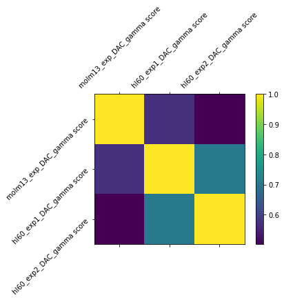
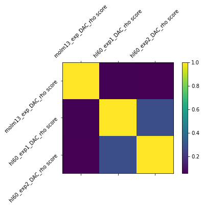
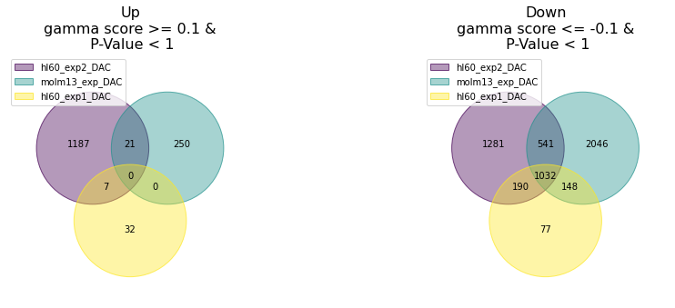
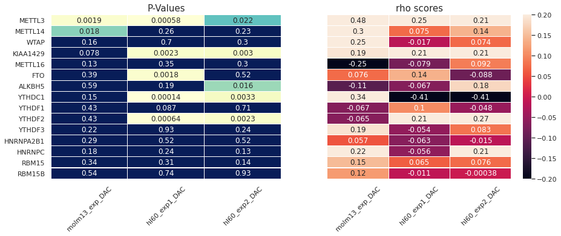
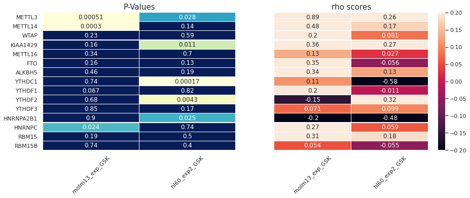

Exploring correlations, differences, and intersections among the screens.

# Pairwise correlations

### DAC gamma-score

    

### DAC rho-score
    

    

# Intersection

### DAC rho-score

    hl60_exp2_DAC
    up:  3170
    down: 2819
    molm13_exp_DAC
    up:  3837
    down: 4027
    hl60_exp1_DAC
    up:  1109
    down: 1616
    

    
### DAC gamma-score

    hl60_exp2_DAC
    up:  1215
    down: 3044
    molm13_exp_DAC
    up:  271
    down: 3767
    hl60_exp1_DAC
    up:  39
    down: 1447

    

    

# m6A reader and writer genes 
[Table 1](https://www.nature.com/articles/s41419-017-0129-x/tables/1) at
> Dai, D., Wang, H., Zhu, L. et al. N6-methyladenosine links RNA metabolism to cancer progression. _Cell Death Dis_ **9**, 124 (2018). https://doi.org/10.1038/s41419-017-0129-x

<table border="1" class="dataframe">
  <thead>
    <tr style="text-align: right;">
      <th></th>
      <th>Type</th>
      <th>Names</th>
      <th>Functional classification</th>
      <th>Functions in m6A regulation and RNA metabolism</th>
      <th>References (Pubmed ID)</th>
    </tr>
  </thead>
  <tbody>
    <tr>
      <th>0</th>
      <td>m6A writer</td>
      <td>METTL3</td>
      <td>Catalytic m6A methyltransferase</td>
      <td>Create m6A sites (most near 3_ UTRs, catalytic...</td>
      <td>24316715</td>
    </tr>
    <tr>
      <th>1</th>
      <td>m6A writer</td>
      <td>METTL14</td>
      <td>Subunit of METTL3 m6A methyltransferase complex</td>
      <td>Help METTL3 to recognize substrate</td>
      <td>27373337</td>
    </tr>
    <tr>
      <th>2</th>
      <td>m6A writer</td>
      <td>WTAP</td>
      <td>Subunit of METTL3 m6A methyltransferase complex</td>
      <td>Adaptor protein to lead METTL3ÐMETTL14 heterod...</td>
      <td>24981863</td>
    </tr>
    <tr>
      <th>3</th>
      <td>m6A writer</td>
      <td>KIAA1429</td>
      <td>Subunit of METTL3 m6A methyltransferase complex</td>
      <td>Adaptor protein to lead METTL3ÐMETTL14 heterod...</td>
      <td>24981863</td>
    </tr>
    <tr>
      <th>4</th>
      <td>m6A writer</td>
      <td>RBM15 and its paralogue RBM15B</td>
      <td>Subunit of METTL3 m6A methyltransferase complex</td>
      <td>Determine which DRACH sites are methylated</td>
      <td>27602518</td>
    </tr>
    <tr>
      <th>5</th>
      <td>m6A writer</td>
      <td>METTL16</td>
      <td>Catalytic m6A methyltransferase</td>
      <td>m6A sitesÊcreation (most in introns, catalytic...</td>
      <td>28525753</td>
    </tr>
    <tr>
      <th>6</th>
      <td>m6A eraser</td>
      <td>FTO</td>
      <td>m6A demethylase (catalytic site is H231 and D233)</td>
      <td>RNA demethylation, mRNA splicing</td>
      <td>25412662</td>
    </tr>
    <tr>
      <th>7</th>
      <td>m6A eraser</td>
      <td>ALKBH5</td>
      <td>m6A demethylase (catalytic site is H204 or H266)</td>
      <td>RNA demethylation, mRNA processing, mRNA expor...</td>
      <td>23177736, 28344040</td>
    </tr>
    <tr>
      <th>8</th>
      <td>m6A reader</td>
      <td>YTHDC1</td>
      <td>Direct reader</td>
      <td>mRNA splicing</td>
      <td>26876937</td>
    </tr>
    <tr>
      <th>9</th>
      <td>m6A reader</td>
      <td>YTHDF1</td>
      <td>Direct reader</td>
      <td>mRNA translation</td>
      <td>26046440</td>
    </tr>
    <tr>
      <th>10</th>
      <td>m6A reader</td>
      <td>YTHDF2</td>
      <td>Direct reader</td>
      <td>mRNA decay</td>
      <td>27558897</td>
    </tr>
    <tr>
      <th>11</th>
      <td>m6A reader</td>
      <td>YTHDF3</td>
      <td>Direct reader</td>
      <td>Interacted with YTHDF1 and YTHDF2 to facilitat...</td>
      <td>28106072</td>
    </tr>
    <tr>
      <th>12</th>
      <td>m6A reader</td>
      <td>HNRNPA2B1</td>
      <td>Direct reader</td>
      <td>miRNA splicing</td>
      <td>26321680</td>
    </tr>
    <tr>
      <th>13</th>
      <td>m6A reader</td>
      <td>EIF3</td>
      <td>Direct reader</td>
      <td>Promote mRNA translation</td>
      <td>26046440</td>
    </tr>
    <tr>
      <th>14</th>
      <td>m6A reader</td>
      <td>HNRNPC</td>
      <td>Indirect m6A reader</td>
      <td>mRNA splicing</td>
      <td>25719671</td>
    </tr>
  </tbody>
</table>

### Rho score of DAC drug in m6A genes 

    
### Rho score of GSK drug in m6A genes 

