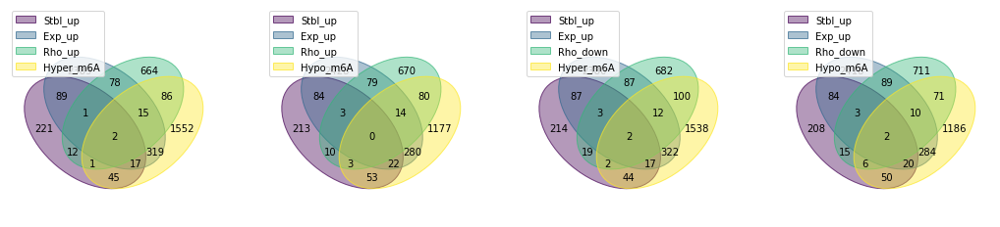
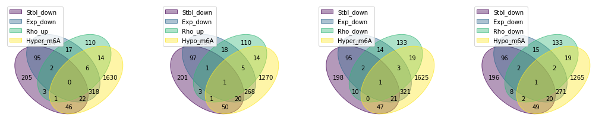

# Main goal: 
Here, we aim to integrate differential analysis results (treated vs. non-treated) toward making a final list of genes which are significantly methylated, expressed and stabilized.

=> table of these genes with all logFCs, pvalues and screening scores.


```python
import pandas as pd 
import numpy as np

from combined_analysis.util import *
```

# Intersectional genes 
Find top genes across all cell lines and high throughput experiments:

- ∆ RNA expression 
- ∆ RNA stability 
- ∆ RNA methylation  
- ∆ Phenotype (CRISPR Screen Rho score)
- ∆ Translational efficiency


```python
Top = {}

Top['TE']   = set_Top_TE  (0,0.05)
Top['Mtyl'] = set_Top_Mtyl(0,0.05)
Top['Rho']  = set_Top_Rho (0,0.05)
Top['Exp']  = set_Top_Exp (0,0.05, 2)
Top['Stbl'] = set_Top_Stbl(0,0.05, 2)

```

  Subset Top TE data frame:
  up:  40
  down: 11
  (te_thr=0, fdr_thr=0.05)
  Subset Top Mtyl data frame:
  up:  2042
  down: 1632
  (fc_thr=0, pv_thr=0.05)
  Subset Top Rho data frame:
  up:  859
  down: 907
  (sc_thr=0, pv_thr=0.05)
  Subset Top Exp data frame:
  up:  2910
  down: 2494
  (fc_thr=0, pv_thr=0.05) in more than 2 cell lines
  Subset Top Stbl data frame:
  up:  388
  down: 374
  (fc_thr=0, pv_thr=0.05) in more than 2 cell lines


### Intersection of all genes across different datasets

- https://pypi.org/project/venn/

Select top gene names 


```python
Exp_up = Top['Exp']['up'].gene_name.tolist()
Stbl_up = Top['Stbl']['up'].gene_name.tolist()
TE_up = Top['TE']['up'].gene_name.tolist()
Rho_up = Top['Rho']['up'].gene_name.tolist()
Hyper_m6A = Top['Mtyl']['up'].gene_name.tolist()

Exp_down = Top['Exp']['down'].gene_name.tolist()
Stbl_down = Top['Stbl']['down'].gene_name.tolist()
TE_down = Top['TE']['down'].gene_name.tolist()
Rho_down = Top['Rho']['down'].gene_name.tolist()
Hypo_m6A = Top['Mtyl']['down'].gene_name.tolist()
```


```python
import numpy as np
import itertools
from matplotlib.pyplot import subplots
from itertools import chain
from venn import venn 

def iter_by_two(input1,input2,input3):
    # inputs are variable names 
    # it will give 8 combinations 
    out = []
    for comb in list(itertools.product(input1,input2,input3)):
        a,b,c = comb
        out.append([a,b,c])
    return out 

studies = iter_by_two(['Exp_up', 'Exp_down'],['Rho_up', 'Rho_down'],['Hyper_m6A', 'Hypo_m6A'])
studies = [[s[0].replace('Exp','Stbl'),s[0],s[1],s[2]] for s in studies]

_, top_axs = subplots(ncols=4, nrows=1, figsize=(18, 8))
_, bot_axs = subplots(ncols=4, nrows=1, figsize=(18, 8))
# cmaps = ["cool", list("rgb"), "plasma", "viridis", "Set1"]
# letters = iter(ascii_uppercase)

for std,ax in zip(studies,chain(top_axs, bot_axs)):
    data = {}
    data = dict([[a,set(eval(a))] for a in std])
    venn(data,fontsize=10,legend_loc="upper left", ax=ax)
```


    

    


    

    


# Final merged table

### Rho_down & Exp_down & Stbl_down & Hyper_m6A


```python
hypothesis1 = list(set(Rho_down).intersection(Exp_down,Stbl_down,Hyper_m6A))

make_final_table(hypothesis1)
```


<div>
<style scoped>
    .dataframe tbody tr th:only-of-type {
        vertical-align: middle;
    }

    .dataframe tbody tr th {
        vertical-align: top;
    }

    .dataframe thead th {
        text-align: right;
    }
</style>
<table border="1" class="dataframe">
  <thead>
    <tr style="text-align: right;">
      <th></th>
      <th>Exp.hl60.log2FC_120h</th>
      <th>Exp.hl60.pval_120h</th>
      <th>Exp.kg1.log2FC</th>
      <th>Exp.kg1.pval</th>
      <th>Exp.molm14.log2FC</th>
      <th>Exp.molm14.pval</th>
      <th>Exp.ociaml2.log2FC</th>
      <th>Exp.ociaml2.pval</th>
      <th>Exp.ociaml3.log2FC</th>
      <th>Exp.ociaml3.pval</th>
      <th>...</th>
      <th>Stbl.ociaml3.logFC</th>
      <th>Stbl.ociaml3.pval</th>
      <th>Stbl.thp1.logFC</th>
      <th>Stbl.thp1.pval</th>
      <th>TE.Estimate_treatmentDRUG</th>
      <th>TE.fdr_Pr...z.._treatmentDRUG</th>
      <th>Rho.Mann-Whitney p-value</th>
      <th>Rho.rho score</th>
      <th>Gamma.Mann-Whitney p-value</th>
      <th>Gamma.gamma score</th>
    </tr>
  </thead>
  <tbody>
    <tr>
      <th>PTEN</th>
      <td>-0.043190</td>
      <td>0.243896</td>
      <td>-0.374354</td>
      <td>0.004538</td>
      <td>0.026536</td>
      <td>0.887824</td>
      <td>-0.014289</td>
      <td>0.916647</td>
      <td>0.174083</td>
      <td>0.436130</td>
      <td>...</td>
      <td>0.607390</td>
      <td>0.000967</td>
      <td>0.026634</td>
      <td>0.847063</td>
      <td>0.147879</td>
      <td>0.908178</td>
      <td>0.000329498</td>
      <td>-0.329989</td>
      <td>0.000856987</td>
      <td>0.0691307</td>
    </tr>
    <tr>
      <th>CLIP1</th>
      <td>-1.192878</td>
      <td>0.000525</td>
      <td>0.057066</td>
      <td>0.716293</td>
      <td>-0.456842</td>
      <td>0.007228</td>
      <td>-0.127641</td>
      <td>0.455313</td>
      <td>-0.141038</td>
      <td>0.539195</td>
      <td>...</td>
      <td>-0.221320</td>
      <td>0.080116</td>
      <td>-0.201255</td>
      <td>0.044708</td>
      <td>NaN</td>
      <td>NaN</td>
      <td>0.0486743</td>
      <td>-0.0726973</td>
      <td>0.219271</td>
      <td>-0.0194893</td>
    </tr>
    <tr>
      <th>BCL2</th>
      <td>-0.349876</td>
      <td>0.348927</td>
      <td>-0.175130</td>
      <td>0.308083</td>
      <td>-0.858020</td>
      <td>0.000052</td>
      <td>-0.665481</td>
      <td>0.001688</td>
      <td>-0.442377</td>
      <td>0.031822</td>
      <td>...</td>
      <td>0.189016</td>
      <td>0.105029</td>
      <td>-0.044006</td>
      <td>0.625224</td>
      <td>-0.083966</td>
      <td>0.959806</td>
      <td>0.000775687</td>
      <td>-0.410753</td>
      <td>0.000172822</td>
      <td>-0.145611</td>
    </tr>
    <tr>
      <th>P4HB</th>
      <td>-0.002595</td>
      <td>0.767401</td>
      <td>0.530324</td>
      <td>0.000548</td>
      <td>0.346501</td>
      <td>0.021534</td>
      <td>0.006299</td>
      <td>0.957059</td>
      <td>-0.236551</td>
      <td>0.239306</td>
      <td>...</td>
      <td>-0.275514</td>
      <td>0.028601</td>
      <td>-0.048505</td>
      <td>0.702982</td>
      <td>0.129663</td>
      <td>0.151339</td>
      <td>0.0113637</td>
      <td>-0.103476</td>
      <td>0.404723</td>
      <td>0.0134646</td>
    </tr>
  </tbody>
</table>
<p>4 rows × 30 columns</p>
</div>


### Rho_down & Exp_down & Hyper_m6A


```python
hypothesis2 = list(set(Rho_down).intersection(Exp_down,Hyper_m6A))

make_final_table(hypothesis2)
```


<div>
<style scoped>
    .dataframe tbody tr th:only-of-type {
        vertical-align: middle;
    }

    .dataframe tbody tr th {
        vertical-align: top;
    }

    .dataframe thead th {
        text-align: right;
    }
</style>
<table border="1" class="dataframe">
  <thead>
    <tr style="text-align: right;">
      <th></th>
      <th>Exp.hl60.log2FC_120h</th>
      <th>Exp.hl60.pval_120h</th>
      <th>Exp.kg1.log2FC</th>
      <th>Exp.kg1.pval</th>
      <th>Exp.molm14.log2FC</th>
      <th>Exp.molm14.pval</th>
      <th>Exp.ociaml2.log2FC</th>
      <th>Exp.ociaml2.pval</th>
      <th>Exp.ociaml3.log2FC</th>
      <th>Exp.ociaml3.pval</th>
      <th>...</th>
      <th>Stbl.ociaml3.logFC</th>
      <th>Stbl.ociaml3.pval</th>
      <th>Stbl.thp1.logFC</th>
      <th>Stbl.thp1.pval</th>
      <th>TE.Estimate_treatmentDRUG</th>
      <th>TE.fdr_Pr...z.._treatmentDRUG</th>
      <th>Rho.Mann-Whitney p-value</th>
      <th>Rho.rho score</th>
      <th>Gamma.Mann-Whitney p-value</th>
      <th>Gamma.gamma score</th>
    </tr>
  </thead>
  <tbody>
    <tr>
      <th>TRPM2</th>
      <td>-0.037420</td>
      <td>6.970524e-01</td>
      <td>-0.501264</td>
      <td>0.026138</td>
      <td>-0.518698</td>
      <td>1.232178e-02</td>
      <td>-0.198370</td>
      <td>0.176066</td>
      <td>-0.590406</td>
      <td>0.007816</td>
      <td>...</td>
      <td>-0.064611</td>
      <td>0.526100</td>
      <td>-0.225486</td>
      <td>0.127369</td>
      <td>0.243977</td>
      <td>0.563951</td>
      <td>0.028282</td>
      <td>-0.0966818</td>
      <td>0.00215321</td>
      <td>-0.0556825</td>
    </tr>
    <tr>
      <th>P4HB</th>
      <td>-0.002595</td>
      <td>7.674008e-01</td>
      <td>0.530324</td>
      <td>0.000548</td>
      <td>0.346501</td>
      <td>2.153388e-02</td>
      <td>0.006299</td>
      <td>0.957059</td>
      <td>-0.236551</td>
      <td>0.239306</td>
      <td>...</td>
      <td>-0.275514</td>
      <td>0.028601</td>
      <td>-0.048505</td>
      <td>0.702982</td>
      <td>0.129663</td>
      <td>0.151339</td>
      <td>0.0113637</td>
      <td>-0.103476</td>
      <td>0.404723</td>
      <td>0.0134646</td>
    </tr>
    <tr>
      <th>MYBBP1A</th>
      <td>0.924299</td>
      <td>1.221487e-15</td>
      <td>-0.158911</td>
      <td>0.502410</td>
      <td>-0.498212</td>
      <td>3.964706e-02</td>
      <td>-0.240638</td>
      <td>0.270469</td>
      <td>-0.472876</td>
      <td>0.012616</td>
      <td>...</td>
      <td>NaN</td>
      <td>NaN</td>
      <td>NaN</td>
      <td>NaN</td>
      <td>0.127798</td>
      <td>0.873925</td>
      <td>0.00989941</td>
      <td>-0.12811</td>
      <td>0.000181093</td>
      <td>-0.367285</td>
    </tr>
    <tr>
      <th>PTEN</th>
      <td>-0.043190</td>
      <td>2.438965e-01</td>
      <td>-0.374354</td>
      <td>0.004538</td>
      <td>0.026536</td>
      <td>8.878241e-01</td>
      <td>-0.014289</td>
      <td>0.916647</td>
      <td>0.174083</td>
      <td>0.436130</td>
      <td>...</td>
      <td>0.607390</td>
      <td>0.000967</td>
      <td>0.026634</td>
      <td>0.847063</td>
      <td>0.147879</td>
      <td>0.908178</td>
      <td>0.000329498</td>
      <td>-0.329989</td>
      <td>0.000856987</td>
      <td>0.0691307</td>
    </tr>
    <tr>
      <th>WDR90</th>
      <td>1.480258</td>
      <td>7.650223e-04</td>
      <td>-0.012243</td>
      <td>0.955877</td>
      <td>-0.952794</td>
      <td>9.289137e-04</td>
      <td>-0.147226</td>
      <td>0.565691</td>
      <td>-0.268917</td>
      <td>0.370784</td>
      <td>...</td>
      <td>NaN</td>
      <td>NaN</td>
      <td>NaN</td>
      <td>NaN</td>
      <td>NaN</td>
      <td>NaN</td>
      <td>0.0239595</td>
      <td>-0.0810468</td>
      <td>0.0519315</td>
      <td>0.0290127</td>
    </tr>
    <tr>
      <th>PRDM15</th>
      <td>-0.052669</td>
      <td>2.828007e-01</td>
      <td>-0.769876</td>
      <td>0.003200</td>
      <td>0.146448</td>
      <td>5.961705e-01</td>
      <td>-0.228723</td>
      <td>0.491339</td>
      <td>-1.425863</td>
      <td>0.000039</td>
      <td>...</td>
      <td>NaN</td>
      <td>NaN</td>
      <td>NaN</td>
      <td>NaN</td>
      <td>0.072590</td>
      <td>0.971368</td>
      <td>0.00211632</td>
      <td>-0.154041</td>
      <td>0.000412171</td>
      <td>-0.079837</td>
    </tr>
    <tr>
      <th>FAT1</th>
      <td>-0.054781</td>
      <td>4.708737e-01</td>
      <td>0.659045</td>
      <td>0.087709</td>
      <td>1.576543</td>
      <td>4.307025e-04</td>
      <td>-1.404775</td>
      <td>0.069964</td>
      <td>0.824195</td>
      <td>0.004850</td>
      <td>...</td>
      <td>NaN</td>
      <td>NaN</td>
      <td>NaN</td>
      <td>NaN</td>
      <td>NaN</td>
      <td>NaN</td>
      <td>0.0121556</td>
      <td>-0.171184</td>
      <td>0.325553</td>
      <td>-0.0168907</td>
    </tr>
    <tr>
      <th>GNE</th>
      <td>-0.015456</td>
      <td>9.264026e-03</td>
      <td>0.600234</td>
      <td>0.003023</td>
      <td>0.408968</td>
      <td>1.801776e-01</td>
      <td>-0.021052</td>
      <td>0.910227</td>
      <td>-0.294017</td>
      <td>0.182107</td>
      <td>...</td>
      <td>NaN</td>
      <td>NaN</td>
      <td>NaN</td>
      <td>NaN</td>
      <td>0.514365</td>
      <td>0.550430</td>
      <td>0.00347083</td>
      <td>-0.127746</td>
      <td>0.0604554</td>
      <td>0.0320847</td>
    </tr>
    <tr>
      <th>MACF1</th>
      <td>-0.155320</td>
      <td>7.308562e-01</td>
      <td>0.028899</td>
      <td>0.873131</td>
      <td>-0.394813</td>
      <td>1.624712e-02</td>
      <td>-0.138717</td>
      <td>0.448829</td>
      <td>-0.349442</td>
      <td>0.045227</td>
      <td>...</td>
      <td>-0.193142</td>
      <td>0.109224</td>
      <td>-0.201676</td>
      <td>0.053022</td>
      <td>NaN</td>
      <td>NaN</td>
      <td>0.0314761</td>
      <td>-0.0905704</td>
      <td>0.0800886</td>
      <td>0.0647478</td>
    </tr>
    <tr>
      <th>RGS19</th>
      <td>-0.016131</td>
      <td>4.650503e-02</td>
      <td>-1.063766</td>
      <td>0.003845</td>
      <td>-0.308340</td>
      <td>2.796694e-01</td>
      <td>0.350560</td>
      <td>0.243924</td>
      <td>0.910578</td>
      <td>0.028696</td>
      <td>...</td>
      <td>NaN</td>
      <td>NaN</td>
      <td>NaN</td>
      <td>NaN</td>
      <td>0.107834</td>
      <td>0.927907</td>
      <td>0.00644121</td>
      <td>-0.222487</td>
      <td>0.11254</td>
      <td>0.027393</td>
    </tr>
    <tr>
      <th>XRCC2</th>
      <td>-0.238400</td>
      <td>1.628866e-01</td>
      <td>-0.278631</td>
      <td>0.133912</td>
      <td>-0.652996</td>
      <td>3.190609e-03</td>
      <td>-0.336431</td>
      <td>0.046831</td>
      <td>-0.233060</td>
      <td>0.212165</td>
      <td>...</td>
      <td>NaN</td>
      <td>NaN</td>
      <td>NaN</td>
      <td>NaN</td>
      <td>0.233441</td>
      <td>0.886993</td>
      <td>0.0109852</td>
      <td>-0.181475</td>
      <td>0.00137563</td>
      <td>-0.134805</td>
    </tr>
    <tr>
      <th>SCRIB</th>
      <td>-0.629594</td>
      <td>3.743578e-02</td>
      <td>-0.287810</td>
      <td>0.031980</td>
      <td>-0.202809</td>
      <td>1.899146e-01</td>
      <td>-0.058264</td>
      <td>0.717073</td>
      <td>-0.236342</td>
      <td>0.211846</td>
      <td>...</td>
      <td>NaN</td>
      <td>NaN</td>
      <td>NaN</td>
      <td>NaN</td>
      <td>NaN</td>
      <td>NaN</td>
      <td>0.0191153</td>
      <td>-0.096929</td>
      <td>0.0563342</td>
      <td>0.0354932</td>
    </tr>
    <tr>
      <th>BCL2</th>
      <td>-0.349876</td>
      <td>3.489273e-01</td>
      <td>-0.175130</td>
      <td>0.308083</td>
      <td>-0.858020</td>
      <td>5.154137e-05</td>
      <td>-0.665481</td>
      <td>0.001688</td>
      <td>-0.442377</td>
      <td>0.031822</td>
      <td>...</td>
      <td>0.189016</td>
      <td>0.105029</td>
      <td>-0.044006</td>
      <td>0.625224</td>
      <td>-0.083966</td>
      <td>0.959806</td>
      <td>0.000775687</td>
      <td>-0.410753</td>
      <td>0.000172822</td>
      <td>-0.145611</td>
    </tr>
    <tr>
      <th>IL17RA</th>
      <td>-0.913332</td>
      <td>9.445188e-21</td>
      <td>0.956646</td>
      <td>0.000003</td>
      <td>0.651220</td>
      <td>3.595516e-07</td>
      <td>-0.029002</td>
      <td>0.794661</td>
      <td>0.577197</td>
      <td>0.000134</td>
      <td>...</td>
      <td>0.418550</td>
      <td>0.005078</td>
      <td>0.191138</td>
      <td>0.070333</td>
      <td>0.196636</td>
      <td>0.618942</td>
      <td>0.00999347</td>
      <td>-0.140974</td>
      <td>0.482317</td>
      <td>-0.0191967</td>
    </tr>
    <tr>
      <th>CLIP1</th>
      <td>-1.192878</td>
      <td>5.247311e-04</td>
      <td>0.057066</td>
      <td>0.716293</td>
      <td>-0.456842</td>
      <td>7.228368e-03</td>
      <td>-0.127641</td>
      <td>0.455313</td>
      <td>-0.141038</td>
      <td>0.539195</td>
      <td>...</td>
      <td>-0.221320</td>
      <td>0.080116</td>
      <td>-0.201255</td>
      <td>0.044708</td>
      <td>NaN</td>
      <td>NaN</td>
      <td>0.0486743</td>
      <td>-0.0726973</td>
      <td>0.219271</td>
      <td>-0.0194893</td>
    </tr>
    <tr>
      <th>NUP153</th>
      <td>0.387412</td>
      <td>1.200297e-03</td>
      <td>-0.031894</td>
      <td>0.827100</td>
      <td>-0.234767</td>
      <td>9.613861e-02</td>
      <td>-0.188935</td>
      <td>0.255498</td>
      <td>-0.409698</td>
      <td>0.039677</td>
      <td>...</td>
      <td>-0.021257</td>
      <td>0.862460</td>
      <td>-0.051305</td>
      <td>0.536046</td>
      <td>0.035116</td>
      <td>0.953897</td>
      <td>0.0193773</td>
      <td>-0.0937259</td>
      <td>0.141886</td>
      <td>-0.0207409</td>
    </tr>
  </tbody>
</table>
<p>16 rows × 30 columns</p>
</div>


### Rho_up & Exp_down & Stbl_down & Hyper_m6A


```python
hypothesis3 = list(set(Rho_up).intersection(Exp_down,Stbl_down,Hyper_m6A))

make_final_table(hypothesis3)
```


<div>
<style scoped>
    .dataframe tbody tr th:only-of-type {
        vertical-align: middle;
    }

    .dataframe tbody tr th {
        vertical-align: top;
    }

    .dataframe thead th {
        text-align: right;
    }
</style>
<table border="1" class="dataframe">
  <thead>
    <tr style="text-align: right;">
      <th></th>
      <th>Exp.hl60.log2FC_120h</th>
      <th>Exp.hl60.pval_120h</th>
      <th>Exp.kg1.log2FC</th>
      <th>Exp.kg1.pval</th>
      <th>Exp.molm14.log2FC</th>
      <th>Exp.molm14.pval</th>
      <th>Exp.ociaml2.log2FC</th>
      <th>Exp.ociaml2.pval</th>
      <th>Exp.ociaml3.log2FC</th>
      <th>Exp.ociaml3.pval</th>
      <th>...</th>
      <th>Stbl.ociaml3.logFC</th>
      <th>Stbl.ociaml3.pval</th>
      <th>Stbl.thp1.logFC</th>
      <th>Stbl.thp1.pval</th>
      <th>TE.Estimate_treatmentDRUG</th>
      <th>TE.fdr_Pr...z.._treatmentDRUG</th>
      <th>Rho.Mann-Whitney p-value</th>
      <th>Rho.rho score</th>
      <th>Gamma.Mann-Whitney p-value</th>
      <th>Gamma.gamma score</th>
    </tr>
    <tr>
      <th>gene_name</th>
      <th></th>
      <th></th>
      <th></th>
      <th></th>
      <th></th>
      <th></th>
      <th></th>
      <th></th>
      <th></th>
      <th></th>
      <th></th>
      <th></th>
      <th></th>
      <th></th>
      <th></th>
      <th></th>
      <th></th>
      <th></th>
      <th></th>
      <th></th>
      <th></th>
    </tr>
  </thead>
  <tbody>
    <tr>
      <th>SLC38A2</th>
      <td>0.093455</td>
      <td>0.006681</td>
      <td>0.071612</td>
      <td>0.611155</td>
      <td>-1.191847</td>
      <td>5.722526e-17</td>
      <td>-0.190977</td>
      <td>0.17824</td>
      <td>-0.447406</td>
      <td>0.049998</td>
      <td>...</td>
      <td>-0.317507</td>
      <td>0.015238</td>
      <td>0.05032</td>
      <td>0.625428</td>
      <td>0.259593</td>
      <td>0.442778</td>
      <td>0.000507845</td>
      <td>0.147765</td>
      <td>0.00107525</td>
      <td>-0.0523004</td>
    </tr>
  </tbody>
</table>
<p>1 rows × 30 columns</p>
</div>


### Rho_up & Exp_down & Hyper_m6A


```python
hypothesis4 = list(set(Rho_up).intersection(Exp_down,Hyper_m6A))

make_final_table(hypothesis4)
```


<div>
<style scoped>
    .dataframe tbody tr th:only-of-type {
        vertical-align: middle;
    }

    .dataframe tbody tr th {
        vertical-align: top;
    }

    .dataframe thead th {
        text-align: right;
    }
</style>
<table border="1" class="dataframe">
  <thead>
    <tr style="text-align: right;">
      <th></th>
      <th>Exp.hl60.log2FC_120h</th>
      <th>Exp.hl60.pval_120h</th>
      <th>Exp.kg1.log2FC</th>
      <th>Exp.kg1.pval</th>
      <th>Exp.molm14.log2FC</th>
      <th>Exp.molm14.pval</th>
      <th>Exp.ociaml2.log2FC</th>
      <th>Exp.ociaml2.pval</th>
      <th>Exp.ociaml3.log2FC</th>
      <th>Exp.ociaml3.pval</th>
      <th>...</th>
      <th>Stbl.ociaml3.logFC</th>
      <th>Stbl.ociaml3.pval</th>
      <th>Stbl.thp1.logFC</th>
      <th>Stbl.thp1.pval</th>
      <th>TE.Estimate_treatmentDRUG</th>
      <th>TE.fdr_Pr...z.._treatmentDRUG</th>
      <th>Rho.Mann-Whitney p-value</th>
      <th>Rho.rho score</th>
      <th>Gamma.Mann-Whitney p-value</th>
      <th>Gamma.gamma score</th>
    </tr>
  </thead>
  <tbody>
    <tr>
      <th>UHRF1</th>
      <td>0.531555</td>
      <td>1.758350e-05</td>
      <td>-0.203560</td>
      <td>0.203841</td>
      <td>-0.341414</td>
      <td>1.792914e-02</td>
      <td>-0.206180</td>
      <td>0.119950</td>
      <td>-0.195101</td>
      <td>0.291769</td>
      <td>...</td>
      <td>-0.204375</td>
      <td>0.175788</td>
      <td>0.059026</td>
      <td>0.669261</td>
      <td>NaN</td>
      <td>NaN</td>
      <td>0.0427943</td>
      <td>0.12052</td>
      <td>0.00961853</td>
      <td>-0.317194</td>
    </tr>
    <tr>
      <th>GPT2</th>
      <td>1.524728</td>
      <td>4.309582e-12</td>
      <td>-0.336287</td>
      <td>0.096915</td>
      <td>-1.770456</td>
      <td>2.738655e-20</td>
      <td>0.132678</td>
      <td>0.713788</td>
      <td>-0.644829</td>
      <td>0.010065</td>
      <td>...</td>
      <td>NaN</td>
      <td>NaN</td>
      <td>NaN</td>
      <td>NaN</td>
      <td>0.354041</td>
      <td>0.644297</td>
      <td>0.0473591</td>
      <td>0.125704</td>
      <td>0.154324</td>
      <td>-0.108191</td>
    </tr>
    <tr>
      <th>ASCC3</th>
      <td>0.745191</td>
      <td>6.915685e-03</td>
      <td>-0.294442</td>
      <td>0.041738</td>
      <td>-0.060169</td>
      <td>7.057223e-01</td>
      <td>-0.075511</td>
      <td>0.546076</td>
      <td>0.038017</td>
      <td>0.855646</td>
      <td>...</td>
      <td>0.304848</td>
      <td>0.029294</td>
      <td>0.264479</td>
      <td>0.054867</td>
      <td>-0.091706</td>
      <td>0.905505</td>
      <td>0.0351948</td>
      <td>0.196043</td>
      <td>0.000294497</td>
      <td>-0.150862</td>
    </tr>
    <tr>
      <th>SF3B5</th>
      <td>1.203213</td>
      <td>4.116974e-03</td>
      <td>-0.435174</td>
      <td>0.044762</td>
      <td>0.057846</td>
      <td>8.042197e-01</td>
      <td>-0.082510</td>
      <td>0.725900</td>
      <td>-0.290105</td>
      <td>0.434542</td>
      <td>...</td>
      <td>NaN</td>
      <td>NaN</td>
      <td>NaN</td>
      <td>NaN</td>
      <td>0.103536</td>
      <td>0.921463</td>
      <td>0.0325592</td>
      <td>0.229272</td>
      <td>0.0141978</td>
      <td>-0.151714</td>
    </tr>
    <tr>
      <th>NOL10</th>
      <td>0.703616</td>
      <td>8.709135e-05</td>
      <td>0.064696</td>
      <td>0.646424</td>
      <td>-0.504675</td>
      <td>1.469999e-03</td>
      <td>-0.152826</td>
      <td>0.323571</td>
      <td>-0.304531</td>
      <td>0.187574</td>
      <td>...</td>
      <td>0.114226</td>
      <td>0.516558</td>
      <td>0.131014</td>
      <td>0.242626</td>
      <td>-0.008543</td>
      <td>0.992870</td>
      <td>0.0451808</td>
      <td>0.0648528</td>
      <td>0.0209127</td>
      <td>-0.14716</td>
    </tr>
    <tr>
      <th>TET2</th>
      <td>-0.527016</td>
      <td>2.863628e-05</td>
      <td>0.406066</td>
      <td>0.047659</td>
      <td>0.755745</td>
      <td>1.383146e-02</td>
      <td>0.273744</td>
      <td>0.218360</td>
      <td>0.338139</td>
      <td>0.343063</td>
      <td>...</td>
      <td>NaN</td>
      <td>NaN</td>
      <td>NaN</td>
      <td>NaN</td>
      <td>NaN</td>
      <td>NaN</td>
      <td>0.0446586</td>
      <td>0.157896</td>
      <td>0.849894</td>
      <td>0.0208175</td>
    </tr>
    <tr>
      <th>SLC38A5</th>
      <td>4.054743</td>
      <td>1.662798e-24</td>
      <td>-0.025667</td>
      <td>0.882894</td>
      <td>-0.616488</td>
      <td>6.400979e-02</td>
      <td>-0.431919</td>
      <td>0.132093</td>
      <td>-1.162242</td>
      <td>0.000057</td>
      <td>...</td>
      <td>NaN</td>
      <td>NaN</td>
      <td>NaN</td>
      <td>NaN</td>
      <td>0.066110</td>
      <td>0.945820</td>
      <td>0.00292038</td>
      <td>0.102464</td>
      <td>0.0090272</td>
      <td>-0.0542386</td>
    </tr>
    <tr>
      <th>HPS4</th>
      <td>0.909969</td>
      <td>2.881971e-04</td>
      <td>-0.397124</td>
      <td>0.025435</td>
      <td>-0.309156</td>
      <td>1.722613e-01</td>
      <td>0.080886</td>
      <td>0.721161</td>
      <td>-0.061893</td>
      <td>0.834283</td>
      <td>...</td>
      <td>NaN</td>
      <td>NaN</td>
      <td>NaN</td>
      <td>NaN</td>
      <td>0.028135</td>
      <td>0.988401</td>
      <td>0.027618</td>
      <td>0.148254</td>
      <td>0.355666</td>
      <td>0.0349674</td>
    </tr>
    <tr>
      <th>EP400</th>
      <td>0.056058</td>
      <td>7.332842e-01</td>
      <td>0.035975</td>
      <td>0.778765</td>
      <td>-0.356828</td>
      <td>1.350930e-02</td>
      <td>-0.092179</td>
      <td>0.496772</td>
      <td>-0.467815</td>
      <td>0.010213</td>
      <td>...</td>
      <td>NaN</td>
      <td>NaN</td>
      <td>NaN</td>
      <td>NaN</td>
      <td>0.129425</td>
      <td>0.770643</td>
      <td>0.0043054</td>
      <td>0.384251</td>
      <td>0.00253747</td>
      <td>-0.206212</td>
    </tr>
    <tr>
      <th>ACSF3</th>
      <td>-0.272758</td>
      <td>2.344411e-01</td>
      <td>-0.086144</td>
      <td>0.664926</td>
      <td>-0.587529</td>
      <td>2.824242e-02</td>
      <td>-0.826967</td>
      <td>0.012466</td>
      <td>-0.638348</td>
      <td>0.020681</td>
      <td>...</td>
      <td>NaN</td>
      <td>NaN</td>
      <td>NaN</td>
      <td>NaN</td>
      <td>0.080759</td>
      <td>0.970239</td>
      <td>0.0160557</td>
      <td>0.114455</td>
      <td>0.416631</td>
      <td>0.000913454</td>
    </tr>
    <tr>
      <th>BLOC1S2</th>
      <td>0.153318</td>
      <td>5.004108e-01</td>
      <td>-0.924001</td>
      <td>0.006326</td>
      <td>1.386499</td>
      <td>7.090696e-04</td>
      <td>0.048988</td>
      <td>0.885272</td>
      <td>0.256314</td>
      <td>0.442406</td>
      <td>...</td>
      <td>NaN</td>
      <td>NaN</td>
      <td>NaN</td>
      <td>NaN</td>
      <td>0.472504</td>
      <td>0.775010</td>
      <td>0.0457501</td>
      <td>0.0891427</td>
      <td>0.00254449</td>
      <td>-0.0365893</td>
    </tr>
    <tr>
      <th>MRPS27</th>
      <td>-0.217467</td>
      <td>3.145223e-01</td>
      <td>-0.377820</td>
      <td>0.037328</td>
      <td>0.065169</td>
      <td>7.956146e-01</td>
      <td>-0.312939</td>
      <td>0.018535</td>
      <td>0.331883</td>
      <td>0.286173</td>
      <td>...</td>
      <td>0.240826</td>
      <td>0.064552</td>
      <td>0.091334</td>
      <td>0.510175</td>
      <td>-0.223810</td>
      <td>0.806329</td>
      <td>0.0174467</td>
      <td>0.140484</td>
      <td>0.000166573</td>
      <td>-0.156413</td>
    </tr>
    <tr>
      <th>MRPL17</th>
      <td>0.644583</td>
      <td>9.981739e-05</td>
      <td>-0.033246</td>
      <td>0.890657</td>
      <td>-0.274149</td>
      <td>1.827730e-01</td>
      <td>-0.107827</td>
      <td>0.582679</td>
      <td>-0.405725</td>
      <td>0.034769</td>
      <td>...</td>
      <td>NaN</td>
      <td>NaN</td>
      <td>NaN</td>
      <td>NaN</td>
      <td>-0.099474</td>
      <td>0.927907</td>
      <td>0.00496749</td>
      <td>0.133431</td>
      <td>0.0547314</td>
      <td>-0.105165</td>
    </tr>
    <tr>
      <th>MAP1S</th>
      <td>-0.067245</td>
      <td>2.231714e-02</td>
      <td>-0.496985</td>
      <td>0.043640</td>
      <td>-0.106316</td>
      <td>6.606689e-01</td>
      <td>0.316779</td>
      <td>0.342906</td>
      <td>-0.065413</td>
      <td>0.780347</td>
      <td>...</td>
      <td>NaN</td>
      <td>NaN</td>
      <td>NaN</td>
      <td>NaN</td>
      <td>-0.121695</td>
      <td>0.914051</td>
      <td>0.0224223</td>
      <td>0.155621</td>
      <td>0.405195</td>
      <td>-0.00407295</td>
    </tr>
    <tr>
      <th>SLC38A2</th>
      <td>0.093455</td>
      <td>6.681441e-03</td>
      <td>0.071612</td>
      <td>0.611155</td>
      <td>-1.191847</td>
      <td>5.722526e-17</td>
      <td>-0.190977</td>
      <td>0.178240</td>
      <td>-0.447406</td>
      <td>0.049998</td>
      <td>...</td>
      <td>-0.317507</td>
      <td>0.015238</td>
      <td>0.050320</td>
      <td>0.625428</td>
      <td>0.259593</td>
      <td>0.442778</td>
      <td>0.000507845</td>
      <td>0.147765</td>
      <td>0.00107525</td>
      <td>-0.0523004</td>
    </tr>
  </tbody>
</table>
<p>15 rows × 30 columns</p>
</div>
