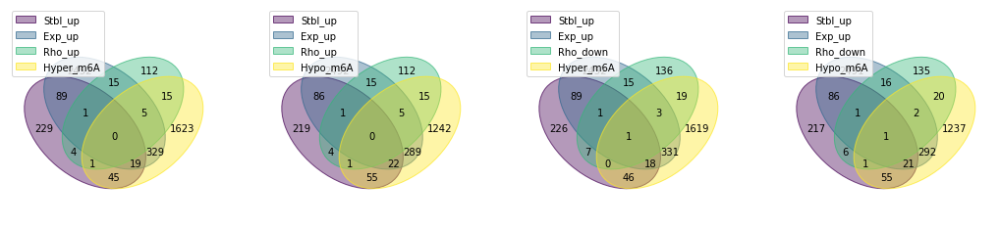

# Main goal: 
Here, we aim to integrate differential analysis results (treated vs. non-treated) toward making a final list of genes which are significantly methylated, expressed and stabilized.

=> table of these genes with all logFCs, pvalues and screening scores.

### Load data
Comparing treated with Decitabine vs. non-treated:
- **$\Delta$RNA methylation**  (hl60 cell line)
- **$\Delta$Translational efficiency** (hl60 cell line)
- **$\Delta$RNA expression** (For all 6 AML cell lines)
- **$\Delta$RNA stability** (For all 6 AML cell lines)
- **$\Delta$Phenotype, CRISPRi-screen $\rho$(rho) score** (hl60 and molm13 cell lines) 

Find top genes across all cell lines and high throughput experiments:

    Subset Top TE data frame:
    up:  40
    down: 11
    (te_thr=0, fdr_thr=0.05)
    Subset Top Mtyl data frame:
    up:  2042
    down: 1632
    (fc_thr=0, pv_thr=0.05)
    Subset Top Exp data frame:
    up:  2910
    down: 2494
    (fc_thr=0, pv_thr=0.05) in more than 2 cell lines
    Subset Top Stbl data frame:
    up:  388
    down: 374
    (fc_thr=0, pv_thr=0.05) in more than 2 cell lines
    Subset Top Rho data frame:
    up:  153
    down: 182
    (sc_thr=0.1, pv_thr=1) in both molm13 and hl60 (2 replicates) cell lines

### Intersection of all genes across different datasets

- https://pypi.org/project/venn/

Select top gene names 

    

    

# Final merged table

## Hypothesis 1
### Rho_down & Exp_down & Stbl_down & Hyper_m6A

<table border="1" class="dataframe">
  <thead>
    <tr style="text-align: right;">
      <th></th>
      <th>Exp.hl60.log2FC_120h</th>
      <th>Exp.hl60.pval_120h</th>
      <th>Exp.kg1.log2FC</th>
      <th>Exp.kg1.pval</th>
      <th>Exp.molm14.log2FC</th>
      <th>Exp.molm14.pval</th>
      <th>Exp.ociaml2.log2FC</th>
      <th>Exp.ociaml2.pval</th>
      <th>Exp.ociaml3.log2FC</th>
      <th>Exp.ociaml3.pval</th>
      <th>...</th>
      <th>Stbl.molm14.logFC</th>
      <th>Stbl.molm14.pval</th>
      <th>Stbl.ociaml2.logFC</th>
      <th>Stbl.ociaml2.pval</th>
      <th>Stbl.ociaml3.logFC</th>
      <th>Stbl.ociaml3.pval</th>
      <th>Stbl.thp1.logFC</th>
      <th>Stbl.thp1.pval</th>
      <th>TE.Estimate_treatmentDRUG</th>
      <th>TE.fdr_Pr...z.._treatmentDRUG</th>
    </tr>
    <tr>
      <th>gene_name</th>
      <th></th>
      <th></th>
      <th></th>
      <th></th>
      <th></th>
      <th></th>
      <th></th>
      <th></th>
      <th></th>
      <th></th>
      <th></th>
      <th></th>
      <th></th>
      <th></th>
      <th></th>
      <th></th>
      <th></th>
      <th></th>
      <th></th>
      <th></th>
      <th></th>
    </tr>
  </thead>
  <tbody>
    <tr>
      <th>PTEN</th>
      <td>-0.043</td>
      <td>0.244</td>
      <td>-0.374</td>
      <td>0.005</td>
      <td>0.027</td>
      <td>0.888</td>
      <td>-0.014</td>
      <td>0.917</td>
      <td>0.174</td>
      <td>0.436</td>
      <td>...</td>
      <td>-0.084</td>
      <td>0.462</td>
      <td>-0.204</td>
      <td>0.276</td>
      <td>0.607</td>
      <td>0.001</td>
      <td>0.027</td>
      <td>0.847</td>
      <td>0.148</td>
      <td>0.908</td>
    </tr>
  </tbody>
</table>

1 rows × 26 columns

<table border="1" class="dataframe">
  <thead>
    <tr style="text-align: right;">
      <th></th>
      <th>hl60_exp1_DAC_rho_score</th>
      <th>hl60_exp1_DAC_rho_p-value</th>
      <th>hl60_exp2_DAC_rho_score</th>
      <th>hl60_exp2_DAC_rho_p-value</th>
      <th>hl60_exp2_GSK_rho_score</th>
      <th>hl60_exp2_GSK_rho_p-value</th>
      <th>molm13_exp_DAC_gamma_score</th>
      <th>molm13_exp_DAC_gamma_p-value</th>
      <th>molm13_exp_GSK_gamma_score</th>
      <th>molm13_exp_GSK_gamma_p-value</th>
    </tr>
    <tr>
      <th>gene_name</th>
      <th></th>
      <th></th>
      <th></th>
      <th></th>
      <th></th>
      <th></th>
      <th></th>
      <th></th>
      <th></th>
      <th></th>
    </tr>
  </thead>
  <tbody>
    <tr>
      <th>PTEN</th>
      <td>-0.33</td>
      <td>0.0</td>
      <td>-0.284</td>
      <td>0.097</td>
      <td>-0.29</td>
      <td>0.002</td>
      <td>-0.042</td>
      <td>0.806</td>
      <td>-0.042</td>
      <td>0.806</td>
    </tr>
  </tbody>
</table>

## Hypothesis 2
### Rho_down & Exp_down & Hyper_m6A

<table border="1" class="dataframe">
  <thead>
    <tr style="text-align: right;">
      <th></th>
      <th>Exp.hl60.log2FC_120h</th>
      <th>Exp.hl60.pval_120h</th>
      <th>Exp.kg1.log2FC</th>
      <th>Exp.kg1.pval</th>
      <th>Exp.molm14.log2FC</th>
      <th>Exp.molm14.pval</th>
      <th>Exp.ociaml2.log2FC</th>
      <th>Exp.ociaml2.pval</th>
      <th>Exp.ociaml3.log2FC</th>
      <th>Exp.ociaml3.pval</th>
      <th>...</th>
      <th>Stbl.molm14.logFC</th>
      <th>Stbl.molm14.pval</th>
      <th>Stbl.ociaml2.logFC</th>
      <th>Stbl.ociaml2.pval</th>
      <th>Stbl.ociaml3.logFC</th>
      <th>Stbl.ociaml3.pval</th>
      <th>Stbl.thp1.logFC</th>
      <th>Stbl.thp1.pval</th>
      <th>TE.Estimate_treatmentDRUG</th>
      <th>TE.fdr_Pr...z.._treatmentDRUG</th>
    </tr>
  </thead>
  <tbody>
    <tr>
      <th>SLFN13</th>
      <td>-0.451</td>
      <td>0.000</td>
      <td>-0.050</td>
      <td>0.895</td>
      <td>0.708</td>
      <td>0.194</td>
      <td>0.228</td>
      <td>0.451</td>
      <td>0.579</td>
      <td>0.187</td>
      <td>...</td>
      <td>NaN</td>
      <td>NaN</td>
      <td>NaN</td>
      <td>NaN</td>
      <td>NaN</td>
      <td>NaN</td>
      <td>NaN</td>
      <td>NaN</td>
      <td>0.432</td>
      <td>0.491</td>
    </tr>
    <tr>
      <th>ATF5</th>
      <td>0.136</td>
      <td>0.920</td>
      <td>0.832</td>
      <td>0.003</td>
      <td>-1.391</td>
      <td>0.000</td>
      <td>-0.035</td>
      <td>0.859</td>
      <td>0.433</td>
      <td>0.097</td>
      <td>...</td>
      <td>NaN</td>
      <td>NaN</td>
      <td>NaN</td>
      <td>NaN</td>
      <td>NaN</td>
      <td>NaN</td>
      <td>NaN</td>
      <td>NaN</td>
      <td>0.343</td>
      <td>0.730</td>
    </tr>
    <tr>
      <th>PTEN</th>
      <td>-0.043</td>
      <td>0.244</td>
      <td>-0.374</td>
      <td>0.005</td>
      <td>0.027</td>
      <td>0.888</td>
      <td>-0.014</td>
      <td>0.917</td>
      <td>0.174</td>
      <td>0.436</td>
      <td>...</td>
      <td>-0.084</td>
      <td>0.462</td>
      <td>-0.204</td>
      <td>0.276</td>
      <td>0.607</td>
      <td>0.001</td>
      <td>0.027</td>
      <td>0.847</td>
      <td>0.148</td>
      <td>0.908</td>
    </tr>
    <tr>
      <th>UBXN7</th>
      <td>-0.284</td>
      <td>0.001</td>
      <td>-0.073</td>
      <td>0.653</td>
      <td>0.506</td>
      <td>0.023</td>
      <td>0.085</td>
      <td>0.580</td>
      <td>-0.004</td>
      <td>0.987</td>
      <td>...</td>
      <td>-0.104</td>
      <td>0.348</td>
      <td>-0.064</td>
      <td>0.574</td>
      <td>-0.177</td>
      <td>0.230</td>
      <td>-0.354</td>
      <td>0.026</td>
      <td>-0.111</td>
      <td>0.922</td>
    </tr>
  </tbody>
</table>

4 rows × 26 columns

<table border="1" class="dataframe">
  <thead>
    <tr style="text-align: right;">
      <th></th>
      <th>hl60_exp1_DAC_rho_score</th>
      <th>hl60_exp1_DAC_rho_p-value</th>
      <th>hl60_exp2_DAC_rho_score</th>
      <th>hl60_exp2_DAC_rho_p-value</th>
      <th>hl60_exp2_GSK_rho_score</th>
      <th>hl60_exp2_GSK_rho_p-value</th>
      <th>molm13_exp_DAC_gamma_score</th>
      <th>molm13_exp_DAC_gamma_p-value</th>
      <th>molm13_exp_GSK_gamma_score</th>
      <th>molm13_exp_GSK_gamma_p-value</th>
    </tr>
    <tr>
      <th>gene_name</th>
      <th></th>
      <th></th>
      <th></th>
      <th></th>
      <th></th>
      <th></th>
      <th></th>
      <th></th>
      <th></th>
      <th></th>
    </tr>
  </thead>
  <tbody>
    <tr>
      <th>SLFN13</th>
      <td>-0.117</td>
      <td>0.386</td>
      <td>-0.271</td>
      <td>0.121</td>
      <td>-0.300</td>
      <td>0.380</td>
      <td>-0.044</td>
      <td>0.943</td>
      <td>-0.044</td>
      <td>0.943</td>
    </tr>
    <tr>
      <th>ATF5</th>
      <td>-0.254</td>
      <td>0.090</td>
      <td>-0.217</td>
      <td>0.033</td>
      <td>-0.273</td>
      <td>0.023</td>
      <td>-0.288</td>
      <td>0.220</td>
      <td>-0.288</td>
      <td>0.220</td>
    </tr>
    <tr>
      <th>PTEN</th>
      <td>-0.330</td>
      <td>0.000</td>
      <td>-0.284</td>
      <td>0.097</td>
      <td>-0.290</td>
      <td>0.002</td>
      <td>-0.042</td>
      <td>0.806</td>
      <td>-0.042</td>
      <td>0.806</td>
    </tr>
    <tr>
      <th>UBXN7</th>
      <td>-0.106</td>
      <td>0.357</td>
      <td>-0.201</td>
      <td>0.005</td>
      <td>-0.267</td>
      <td>0.013</td>
      <td>-0.043</td>
      <td>0.278</td>
      <td>-0.043</td>
      <td>0.278</td>
    </tr>
  </tbody>
</table>

## Hypothesis 3

### Rho_up & Exp_down & Stbl_down & Hyper_m6A

    0

## Hypothesis 4
### Rho_up & Exp_down & Hyper_m6A

<table border="1" class="dataframe">
  <thead>
    <tr style="text-align: right;">
      <th></th>
      <th>Exp.hl60.log2FC_120h</th>
      <th>Exp.hl60.pval_120h</th>
      <th>Exp.kg1.log2FC</th>
      <th>Exp.kg1.pval</th>
      <th>Exp.molm14.log2FC</th>
      <th>Exp.molm14.pval</th>
      <th>Exp.ociaml2.log2FC</th>
      <th>Exp.ociaml2.pval</th>
      <th>Exp.ociaml3.log2FC</th>
      <th>Exp.ociaml3.pval</th>
      <th>...</th>
      <th>Stbl.molm14.logFC</th>
      <th>Stbl.molm14.pval</th>
      <th>Stbl.ociaml2.logFC</th>
      <th>Stbl.ociaml2.pval</th>
      <th>Stbl.ociaml3.logFC</th>
      <th>Stbl.ociaml3.pval</th>
      <th>Stbl.thp1.logFC</th>
      <th>Stbl.thp1.pval</th>
      <th>TE.Estimate_treatmentDRUG</th>
      <th>TE.fdr_Pr...z.._treatmentDRUG</th>
    </tr>
  </thead>
  <tbody>
    <tr>
      <th>UHRF1</th>
      <td>0.532</td>
      <td>0.000</td>
      <td>-0.204</td>
      <td>0.204</td>
      <td>-0.341</td>
      <td>0.018</td>
      <td>-0.206</td>
      <td>0.120</td>
      <td>-0.195</td>
      <td>0.292</td>
      <td>...</td>
      <td>-0.283</td>
      <td>0.036</td>
      <td>-0.000</td>
      <td>1.000</td>
      <td>-0.204</td>
      <td>0.176</td>
      <td>0.059</td>
      <td>0.669</td>
      <td>NaN</td>
      <td>NaN</td>
    </tr>
    <tr>
      <th>SYNCRIP</th>
      <td>1.010</td>
      <td>0.000</td>
      <td>-0.135</td>
      <td>0.284</td>
      <td>-0.361</td>
      <td>0.028</td>
      <td>-0.122</td>
      <td>0.427</td>
      <td>-0.005</td>
      <td>0.985</td>
      <td>...</td>
      <td>-0.078</td>
      <td>0.431</td>
      <td>-0.043</td>
      <td>0.675</td>
      <td>0.109</td>
      <td>0.349</td>
      <td>-0.010</td>
      <td>0.931</td>
      <td>0.126</td>
      <td>0.659</td>
    </tr>
    <tr>
      <th>MRPS27</th>
      <td>-0.217</td>
      <td>0.315</td>
      <td>-0.378</td>
      <td>0.037</td>
      <td>0.065</td>
      <td>0.796</td>
      <td>-0.313</td>
      <td>0.019</td>
      <td>0.332</td>
      <td>0.286</td>
      <td>...</td>
      <td>0.175</td>
      <td>0.109</td>
      <td>0.125</td>
      <td>0.258</td>
      <td>0.241</td>
      <td>0.065</td>
      <td>0.091</td>
      <td>0.510</td>
      <td>-0.224</td>
      <td>0.806</td>
    </tr>
    <tr>
      <th>SF3B5</th>
      <td>1.203</td>
      <td>0.004</td>
      <td>-0.435</td>
      <td>0.045</td>
      <td>0.058</td>
      <td>0.804</td>
      <td>-0.083</td>
      <td>0.726</td>
      <td>-0.290</td>
      <td>0.435</td>
      <td>...</td>
      <td>NaN</td>
      <td>NaN</td>
      <td>NaN</td>
      <td>NaN</td>
      <td>NaN</td>
      <td>NaN</td>
      <td>NaN</td>
      <td>NaN</td>
      <td>0.104</td>
      <td>0.921</td>
    </tr>
    <tr>
      <th>MRPL17</th>
      <td>0.645</td>
      <td>0.000</td>
      <td>-0.033</td>
      <td>0.891</td>
      <td>-0.274</td>
      <td>0.183</td>
      <td>-0.108</td>
      <td>0.583</td>
      <td>-0.406</td>
      <td>0.035</td>
      <td>...</td>
      <td>NaN</td>
      <td>NaN</td>
      <td>NaN</td>
      <td>NaN</td>
      <td>NaN</td>
      <td>NaN</td>
      <td>NaN</td>
      <td>NaN</td>
      <td>-0.099</td>
      <td>0.928</td>
    </tr>
    <tr>
      <th>EP400</th>
      <td>0.056</td>
      <td>0.733</td>
      <td>0.036</td>
      <td>0.779</td>
      <td>-0.357</td>
      <td>0.014</td>
      <td>-0.092</td>
      <td>0.497</td>
      <td>-0.468</td>
      <td>0.010</td>
      <td>...</td>
      <td>NaN</td>
      <td>NaN</td>
      <td>NaN</td>
      <td>NaN</td>
      <td>NaN</td>
      <td>NaN</td>
      <td>NaN</td>
      <td>NaN</td>
      <td>0.129</td>
      <td>0.771</td>
    </tr>
  </tbody>
</table>

6 rows × 26 columns

<table border="1" class="dataframe">
  <thead>
    <tr style="text-align: right;">
      <th></th>
      <th>hl60_exp1_DAC_rho_score</th>
      <th>hl60_exp1_DAC_rho_p-value</th>
      <th>hl60_exp2_DAC_rho_score</th>
      <th>hl60_exp2_DAC_rho_p-value</th>
      <th>hl60_exp2_GSK_rho_score</th>
      <th>hl60_exp2_GSK_rho_p-value</th>
      <th>molm13_exp_DAC_gamma_score</th>
      <th>molm13_exp_DAC_gamma_p-value</th>
      <th>molm13_exp_GSK_gamma_score</th>
      <th>molm13_exp_GSK_gamma_p-value</th>
    </tr>
    <tr>
      <th>gene_name</th>
      <th></th>
      <th></th>
      <th></th>
      <th></th>
      <th></th>
      <th></th>
      <th></th>
      <th></th>
      <th></th>
      <th></th>
    </tr>
  </thead>
  <tbody>
    <tr>
      <th>UHRF1</th>
      <td>0.121</td>
      <td>0.043</td>
      <td>0.165</td>
      <td>0.018</td>
      <td>0.411</td>
      <td>0.003</td>
      <td>-0.093</td>
      <td>0.925</td>
      <td>-0.093</td>
      <td>0.925</td>
    </tr>
    <tr>
      <th>SYNCRIP</th>
      <td>0.100</td>
      <td>0.128</td>
      <td>0.184</td>
      <td>0.003</td>
      <td>0.182</td>
      <td>0.019</td>
      <td>-0.131</td>
      <td>0.311</td>
      <td>-0.131</td>
      <td>0.311</td>
    </tr>
    <tr>
      <th>MRPS27</th>
      <td>0.140</td>
      <td>0.017</td>
      <td>0.101</td>
      <td>0.337</td>
      <td>0.264</td>
      <td>0.003</td>
      <td>-0.215</td>
      <td>0.001</td>
      <td>-0.215</td>
      <td>0.001</td>
    </tr>
    <tr>
      <th>SF3B5</th>
      <td>0.229</td>
      <td>0.033</td>
      <td>0.111</td>
      <td>0.057</td>
      <td>0.102</td>
      <td>0.294</td>
      <td>-0.179</td>
      <td>0.018</td>
      <td>-0.179</td>
      <td>0.018</td>
    </tr>
    <tr>
      <th>MRPL17</th>
      <td>0.133</td>
      <td>0.005</td>
      <td>0.260</td>
      <td>0.038</td>
      <td>0.242</td>
      <td>0.023</td>
      <td>-0.211</td>
      <td>0.249</td>
      <td>-0.211</td>
      <td>0.249</td>
    </tr>
    <tr>
      <th>EP400</th>
      <td>0.384</td>
      <td>0.004</td>
      <td>0.204</td>
      <td>0.009</td>
      <td>0.172</td>
      <td>0.035</td>
      <td>-0.275</td>
      <td>0.119</td>
      <td>-0.275</td>
      <td>0.119</td>
    </tr>
  </tbody>
</table>

# m6A reader and writer genes 
[Table 1](https://www.nature.com/articles/s41419-017-0129-x/tables/1) at
> Dai, D., Wang, H., Zhu, L. et al. N6-methyladenosine links RNA metabolism to cancer progression. _Cell Death Dis_ **9**, 124 (2018). https://doi.org/10.1038/s41419-017-0129-x

<table border="1" class="dataframe">
  <thead>
    <tr style="text-align: right;">
      <th></th>
      <th>Exp.hl60.log2FC_120h</th>
      <th>Exp.hl60.pval_120h</th>
      <th>Exp.kg1.log2FC</th>
      <th>Exp.kg1.pval</th>
      <th>Exp.molm14.log2FC</th>
      <th>Exp.molm14.pval</th>
      <th>Exp.ociaml2.log2FC</th>
      <th>Exp.ociaml2.pval</th>
      <th>Exp.ociaml3.log2FC</th>
      <th>Exp.ociaml3.pval</th>
      <th>...</th>
      <th>Stbl.molm14.logFC</th>
      <th>Stbl.molm14.pval</th>
      <th>Stbl.ociaml2.logFC</th>
      <th>Stbl.ociaml2.pval</th>
      <th>Stbl.ociaml3.logFC</th>
      <th>Stbl.ociaml3.pval</th>
      <th>Stbl.thp1.logFC</th>
      <th>Stbl.thp1.pval</th>
      <th>TE.Estimate_treatmentDRUG</th>
      <th>TE.fdr_Pr...z.._treatmentDRUG</th>
    </tr>
  </thead>
  <tbody>
    <tr>
      <th>METTL3</th>
      <td>-0.112</td>
      <td>0.587</td>
      <td>-0.081</td>
      <td>0.577</td>
      <td>0.100</td>
      <td>0.606</td>
      <td>0.066</td>
      <td>0.756</td>
      <td>-0.009</td>
      <td>0.967</td>
      <td>...</td>
      <td>-0.096</td>
      <td>0.302</td>
      <td>0.055</td>
      <td>0.669</td>
      <td>-0.004</td>
      <td>0.976</td>
      <td>-0.023</td>
      <td>0.827</td>
      <td>0.105</td>
      <td>0.932</td>
    </tr>
    <tr>
      <th>METTL14</th>
      <td>-0.088</td>
      <td>0.230</td>
      <td>0.039</td>
      <td>0.844</td>
      <td>-0.009</td>
      <td>0.966</td>
      <td>0.052</td>
      <td>0.760</td>
      <td>0.223</td>
      <td>0.337</td>
      <td>...</td>
      <td>NaN</td>
      <td>NaN</td>
      <td>NaN</td>
      <td>NaN</td>
      <td>NaN</td>
      <td>NaN</td>
      <td>NaN</td>
      <td>NaN</td>
      <td>0.170</td>
      <td>0.866</td>
    </tr>
    <tr>
      <th>WTAP</th>
      <td>-0.134</td>
      <td>0.798</td>
      <td>0.089</td>
      <td>0.749</td>
      <td>0.279</td>
      <td>0.235</td>
      <td>0.046</td>
      <td>0.867</td>
      <td>0.070</td>
      <td>0.815</td>
      <td>...</td>
      <td>-0.105</td>
      <td>0.500</td>
      <td>0.001</td>
      <td>0.994</td>
      <td>-0.118</td>
      <td>0.475</td>
      <td>-0.078</td>
      <td>0.593</td>
      <td>-0.024</td>
      <td>0.985</td>
    </tr>
    <tr>
      <th>KIAA1429</th>
      <td>NaN</td>
      <td>NaN</td>
      <td>NaN</td>
      <td>NaN</td>
      <td>NaN</td>
      <td>NaN</td>
      <td>NaN</td>
      <td>NaN</td>
      <td>NaN</td>
      <td>NaN</td>
      <td>...</td>
      <td>0.303</td>
      <td>0.050</td>
      <td>-0.077</td>
      <td>0.449</td>
      <td>-0.105</td>
      <td>0.341</td>
      <td>0.019</td>
      <td>0.844</td>
      <td>NaN</td>
      <td>NaN</td>
    </tr>
    <tr>
      <th>METTL16</th>
      <td>0.184</td>
      <td>0.000</td>
      <td>-0.332</td>
      <td>0.135</td>
      <td>-0.480</td>
      <td>0.053</td>
      <td>-0.148</td>
      <td>0.663</td>
      <td>-0.491</td>
      <td>0.017</td>
      <td>...</td>
      <td>NaN</td>
      <td>NaN</td>
      <td>NaN</td>
      <td>NaN</td>
      <td>NaN</td>
      <td>NaN</td>
      <td>NaN</td>
      <td>NaN</td>
      <td>NaN</td>
      <td>NaN</td>
    </tr>
    <tr>
      <th>FTO</th>
      <td>-0.620</td>
      <td>0.574</td>
      <td>-0.250</td>
      <td>0.149</td>
      <td>-0.834</td>
      <td>0.254</td>
      <td>0.575</td>
      <td>0.146</td>
      <td>-0.694</td>
      <td>0.007</td>
      <td>...</td>
      <td>NaN</td>
      <td>NaN</td>
      <td>NaN</td>
      <td>NaN</td>
      <td>NaN</td>
      <td>NaN</td>
      <td>NaN</td>
      <td>NaN</td>
      <td>NaN</td>
      <td>NaN</td>
    </tr>
    <tr>
      <th>ALKBH5</th>
      <td>-0.318</td>
      <td>0.403</td>
      <td>-0.144</td>
      <td>0.410</td>
      <td>-0.102</td>
      <td>0.517</td>
      <td>-0.138</td>
      <td>0.356</td>
      <td>-0.076</td>
      <td>0.667</td>
      <td>...</td>
      <td>NaN</td>
      <td>NaN</td>
      <td>NaN</td>
      <td>NaN</td>
      <td>NaN</td>
      <td>NaN</td>
      <td>NaN</td>
      <td>NaN</td>
      <td>NaN</td>
      <td>NaN</td>
    </tr>
    <tr>
      <th>YTHDC1</th>
      <td>0.120</td>
      <td>0.596</td>
      <td>-0.056</td>
      <td>0.702</td>
      <td>-0.080</td>
      <td>0.609</td>
      <td>0.006</td>
      <td>0.967</td>
      <td>0.100</td>
      <td>0.634</td>
      <td>...</td>
      <td>-0.224</td>
      <td>0.152</td>
      <td>0.051</td>
      <td>0.740</td>
      <td>-0.070</td>
      <td>0.635</td>
      <td>-0.021</td>
      <td>0.853</td>
      <td>NaN</td>
      <td>NaN</td>
    </tr>
    <tr>
      <th>YTHDF1</th>
      <td>-0.224</td>
      <td>0.135</td>
      <td>-0.037</td>
      <td>0.799</td>
      <td>-0.076</td>
      <td>0.698</td>
      <td>0.035</td>
      <td>0.857</td>
      <td>-0.123</td>
      <td>0.542</td>
      <td>...</td>
      <td>NaN</td>
      <td>NaN</td>
      <td>NaN</td>
      <td>NaN</td>
      <td>NaN</td>
      <td>NaN</td>
      <td>NaN</td>
      <td>NaN</td>
      <td>0.561</td>
      <td>0.395</td>
    </tr>
    <tr>
      <th>YTHDF2</th>
      <td>-0.177</td>
      <td>0.148</td>
      <td>0.004</td>
      <td>0.977</td>
      <td>0.278</td>
      <td>0.338</td>
      <td>-0.330</td>
      <td>0.065</td>
      <td>0.145</td>
      <td>0.550</td>
      <td>...</td>
      <td>0.038</td>
      <td>0.704</td>
      <td>-0.159</td>
      <td>0.104</td>
      <td>-0.064</td>
      <td>0.542</td>
      <td>-0.037</td>
      <td>0.710</td>
      <td>0.100</td>
      <td>0.875</td>
    </tr>
    <tr>
      <th>YTHDF3</th>
      <td>-0.020</td>
      <td>0.574</td>
      <td>0.071</td>
      <td>0.571</td>
      <td>0.325</td>
      <td>0.102</td>
      <td>0.059</td>
      <td>0.711</td>
      <td>-0.220</td>
      <td>0.245</td>
      <td>...</td>
      <td>0.540</td>
      <td>0.019</td>
      <td>0.207</td>
      <td>0.074</td>
      <td>0.196</td>
      <td>0.085</td>
      <td>0.170</td>
      <td>0.064</td>
      <td>0.322</td>
      <td>0.601</td>
    </tr>
    <tr>
      <th>HNRNPA2B1</th>
      <td>-0.502</td>
      <td>0.003</td>
      <td>-0.155</td>
      <td>0.372</td>
      <td>-0.302</td>
      <td>0.102</td>
      <td>-0.083</td>
      <td>0.611</td>
      <td>0.068</td>
      <td>0.738</td>
      <td>...</td>
      <td>-0.103</td>
      <td>0.513</td>
      <td>-0.009</td>
      <td>0.938</td>
      <td>-0.107</td>
      <td>0.474</td>
      <td>-0.177</td>
      <td>0.370</td>
      <td>0.252</td>
      <td>0.028</td>
    </tr>
    <tr>
      <th>EIF3</th>
      <td>NaN</td>
      <td>NaN</td>
      <td>NaN</td>
      <td>NaN</td>
      <td>NaN</td>
      <td>NaN</td>
      <td>NaN</td>
      <td>NaN</td>
      <td>NaN</td>
      <td>NaN</td>
      <td>...</td>
      <td>NaN</td>
      <td>NaN</td>
      <td>NaN</td>
      <td>NaN</td>
      <td>NaN</td>
      <td>NaN</td>
      <td>NaN</td>
      <td>NaN</td>
      <td>NaN</td>
      <td>NaN</td>
    </tr>
    <tr>
      <th>HNRNPC</th>
      <td>1.124</td>
      <td>0.011</td>
      <td>-0.146</td>
      <td>0.367</td>
      <td>-0.056</td>
      <td>0.729</td>
      <td>-0.169</td>
      <td>0.204</td>
      <td>-0.074</td>
      <td>0.648</td>
      <td>...</td>
      <td>-0.046</td>
      <td>0.641</td>
      <td>0.013</td>
      <td>0.906</td>
      <td>-0.117</td>
      <td>0.430</td>
      <td>0.176</td>
      <td>0.098</td>
      <td>0.257</td>
      <td>0.191</td>
    </tr>
    <tr>
      <th>RBM15</th>
      <td>-0.220</td>
      <td>0.298</td>
      <td>-0.109</td>
      <td>0.480</td>
      <td>-0.095</td>
      <td>0.627</td>
      <td>-0.100</td>
      <td>0.533</td>
      <td>-0.073</td>
      <td>0.676</td>
      <td>...</td>
      <td>NaN</td>
      <td>NaN</td>
      <td>NaN</td>
      <td>NaN</td>
      <td>NaN</td>
      <td>NaN</td>
      <td>NaN</td>
      <td>NaN</td>
      <td>0.159</td>
      <td>0.845</td>
    </tr>
    <tr>
      <th>RBM15B</th>
      <td>-0.324</td>
      <td>0.229</td>
      <td>-0.068</td>
      <td>0.644</td>
      <td>-0.026</td>
      <td>0.870</td>
      <td>-0.011</td>
      <td>0.940</td>
      <td>0.022</td>
      <td>0.897</td>
      <td>...</td>
      <td>NaN</td>
      <td>NaN</td>
      <td>NaN</td>
      <td>NaN</td>
      <td>NaN</td>
      <td>NaN</td>
      <td>NaN</td>
      <td>NaN</td>
      <td>0.146</td>
      <td>0.928</td>
    </tr>
  </tbody>
</table>

16 rows × 26 columns

<table border="1" class="dataframe">
  <thead>
    <tr style="text-align: right;">
      <th></th>
      <th>hl60_exp1_DAC_rho_score</th>
      <th>hl60_exp1_DAC_rho_p-value</th>
      <th>hl60_exp2_DAC_rho_score</th>
      <th>hl60_exp2_DAC_rho_p-value</th>
      <th>hl60_exp2_GSK_rho_score</th>
      <th>hl60_exp2_GSK_rho_p-value</th>
      <th>molm13_exp_DAC_gamma_score</th>
      <th>molm13_exp_DAC_gamma_p-value</th>
      <th>molm13_exp_GSK_gamma_score</th>
      <th>molm13_exp_GSK_gamma_p-value</th>
    </tr>
  </thead>
  <tbody>
    <tr>
      <th>METTL3</th>
      <td>0.251</td>
      <td>0.001</td>
      <td>0.206</td>
      <td>0.022</td>
      <td>0.257</td>
      <td>0.028</td>
      <td>-0.304</td>
      <td>0.007</td>
      <td>-0.304</td>
      <td>0.007</td>
    </tr>
    <tr>
      <th>METTL14</th>
      <td>0.075</td>
      <td>0.261</td>
      <td>0.142</td>
      <td>0.226</td>
      <td>0.175</td>
      <td>0.137</td>
      <td>-0.181</td>
      <td>0.001</td>
      <td>-0.181</td>
      <td>0.001</td>
    </tr>
    <tr>
      <th>WTAP</th>
      <td>-0.017</td>
      <td>0.701</td>
      <td>0.074</td>
      <td>0.303</td>
      <td>0.081</td>
      <td>0.592</td>
      <td>0.068</td>
      <td>0.418</td>
      <td>0.068</td>
      <td>0.418</td>
    </tr>
    <tr>
      <th>KIAA1429</th>
      <td>0.207</td>
      <td>0.002</td>
      <td>0.212</td>
      <td>0.003</td>
      <td>0.266</td>
      <td>0.011</td>
      <td>-0.513</td>
      <td>0.074</td>
      <td>-0.513</td>
      <td>0.074</td>
    </tr>
    <tr>
      <th>METTL16</th>
      <td>-0.079</td>
      <td>0.355</td>
      <td>0.092</td>
      <td>0.298</td>
      <td>0.027</td>
      <td>0.701</td>
      <td>-0.558</td>
      <td>0.002</td>
      <td>-0.558</td>
      <td>0.002</td>
    </tr>
    <tr>
      <th>FTO</th>
      <td>0.140</td>
      <td>0.002</td>
      <td>-0.088</td>
      <td>0.520</td>
      <td>-0.056</td>
      <td>0.133</td>
      <td>-0.097</td>
      <td>0.042</td>
      <td>-0.097</td>
      <td>0.042</td>
    </tr>
    <tr>
      <th>ALKBH5</th>
      <td>-0.067</td>
      <td>0.187</td>
      <td>0.179</td>
      <td>0.016</td>
      <td>0.127</td>
      <td>0.191</td>
      <td>0.037</td>
      <td>0.641</td>
      <td>0.037</td>
      <td>0.641</td>
    </tr>
    <tr>
      <th>YTHDC1</th>
      <td>-0.411</td>
      <td>0.000</td>
      <td>-0.407</td>
      <td>0.003</td>
      <td>-0.583</td>
      <td>0.000</td>
      <td>-0.359</td>
      <td>0.036</td>
      <td>-0.359</td>
      <td>0.036</td>
    </tr>
    <tr>
      <th>YTHDF1</th>
      <td>0.104</td>
      <td>0.087</td>
      <td>-0.048</td>
      <td>0.712</td>
      <td>-0.011</td>
      <td>0.820</td>
      <td>-0.010</td>
      <td>0.459</td>
      <td>-0.010</td>
      <td>0.459</td>
    </tr>
    <tr>
      <th>YTHDF2</th>
      <td>0.208</td>
      <td>0.001</td>
      <td>0.274</td>
      <td>0.002</td>
      <td>0.324</td>
      <td>0.004</td>
      <td>-0.109</td>
      <td>0.059</td>
      <td>-0.109</td>
      <td>0.059</td>
    </tr>
    <tr>
      <th>YTHDF3</th>
      <td>-0.054</td>
      <td>0.933</td>
      <td>0.083</td>
      <td>0.244</td>
      <td>0.099</td>
      <td>0.167</td>
      <td>0.012</td>
      <td>0.778</td>
      <td>0.012</td>
      <td>0.778</td>
    </tr>
    <tr>
      <th>HNRNPA2B1</th>
      <td>-0.063</td>
      <td>0.518</td>
      <td>-0.015</td>
      <td>0.519</td>
      <td>-0.476</td>
      <td>0.025</td>
      <td>-0.036</td>
      <td>0.219</td>
      <td>-0.036</td>
      <td>0.219</td>
    </tr>
    <tr>
      <th>EIF3</th>
      <td>NaN</td>
      <td>NaN</td>
      <td>NaN</td>
      <td>NaN</td>
      <td>NaN</td>
      <td>NaN</td>
      <td>NaN</td>
      <td>NaN</td>
      <td>NaN</td>
      <td>NaN</td>
    </tr>
    <tr>
      <th>HNRNPC</th>
      <td>-0.056</td>
      <td>0.243</td>
      <td>0.212</td>
      <td>0.130</td>
      <td>0.059</td>
      <td>0.742</td>
      <td>-0.334</td>
      <td>0.016</td>
      <td>-0.334</td>
      <td>0.016</td>
    </tr>
    <tr>
      <th>RBM15</th>
      <td>0.065</td>
      <td>0.307</td>
      <td>0.076</td>
      <td>0.138</td>
      <td>0.185</td>
      <td>0.500</td>
      <td>-0.082</td>
      <td>0.961</td>
      <td>-0.082</td>
      <td>0.961</td>
    </tr>
    <tr>
      <th>RBM15B</th>
      <td>-0.011</td>
      <td>0.740</td>
      <td>-0.000</td>
      <td>0.932</td>
      <td>-0.055</td>
      <td>0.395</td>
      <td>-0.048</td>
      <td>0.650</td>
      <td>-0.048</td>
      <td>0.650</td>
    </tr>
  </tbody>
</table>

