Here, we aim to test the enrichment of hyper methylated genes (logFC >= 2) and hypo methylated genes (logFC <= -2) in all datasets.

## HL-60 cell line - Time series experiment
### Differential RNA Expression
#### hyper_mtyl_6h_delta_exp

#### hypo_mtyl_6h_delta_exp
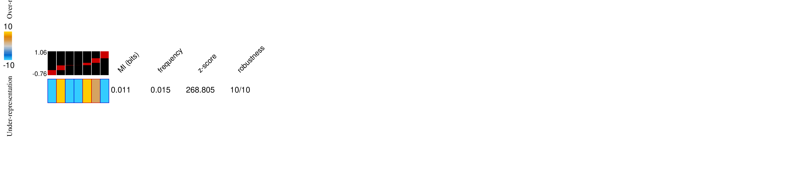

___

#### hyper_mtyl_72h_delta_exp
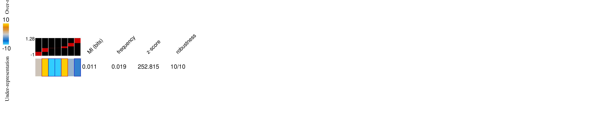

#### hypo_mtyl_72h_delta_exp
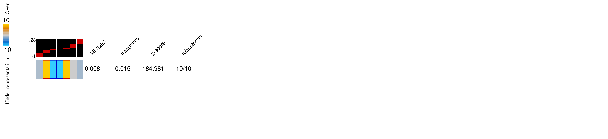

___

#### hyper_mtyl_120h_delta_exp
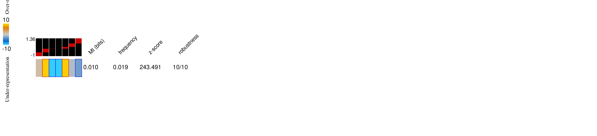

#### hypo_mtyl_120h_delta_exp

## 5 other AML cell lines 
#### hyper_mtyl_kg1_delta_exp

#### hypo_mtyl_kg1_delta_exp

___

#### hyper_mtyl_molm14_delta_exp

#### hypo_mtyl_molm14_delta_exp
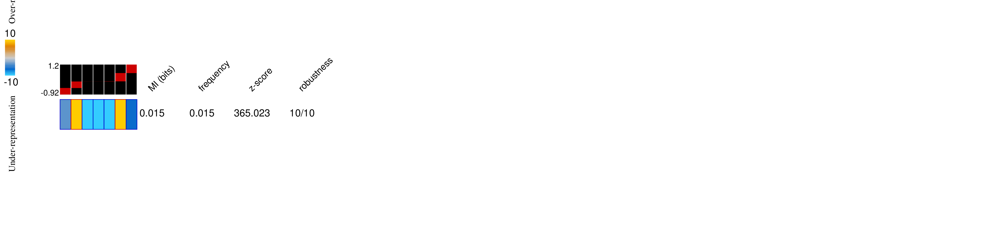

___

#### hyper_mtyl_ociaml2_delta_exp

#### hypo_mtyl_ociaml2_delta_exp

___

#### hyper_mtyl_ociaml3_delta_exp
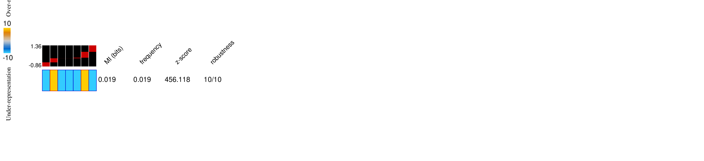

#### hypo_mtyl_ociaml3_delta_exp
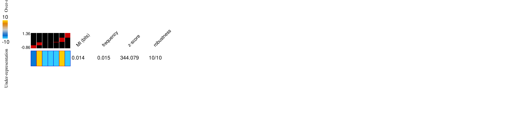

___

#### hyper_mtyl_thp1_delta_exp
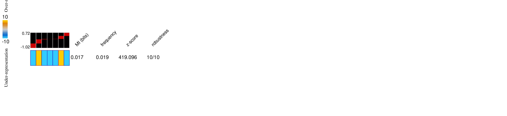

#### hypo_mtyl_thp1_delta_exp
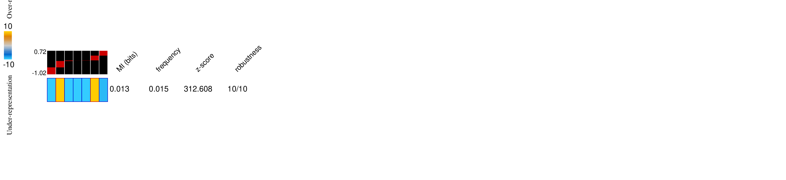

### Differential RNA Stability 
#### hyper_mtyl_6h_delta_stbl

#### hypo_mtyl_6h_delta_stbl

___

#### hyper_mtyl_120h_delta_stbl

#### hypo_mtyl_120h_delta_stbl

## 5 other AML cell lines 

#### hyper_mtyl_kg1_delta_stbl

#### hypo_mtyl_kg1_delta_stbl
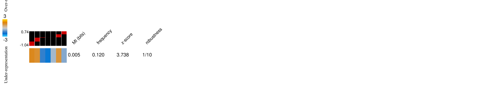

___

#### hyper_mtyl_molm14_delta_stbl
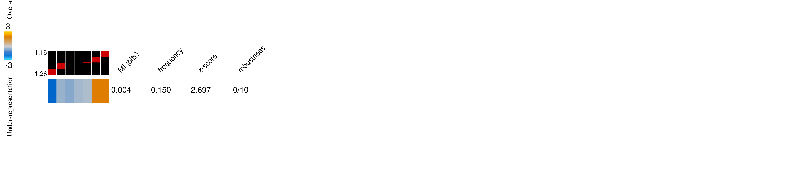

#### hypo_mtyl_molm14_delta_stbl
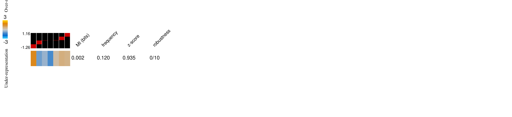

___

#### hyper_mtyl_ociaml2_delta_stbl
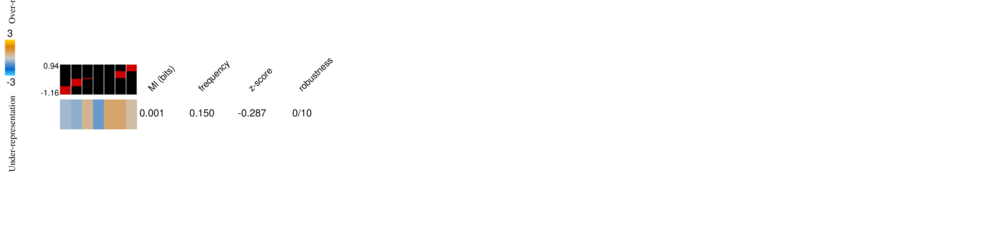

#### hypo_mtyl_ociaml2_delta_stbl

___

#### hyper_mtyl_ociaml3_delta_stbl
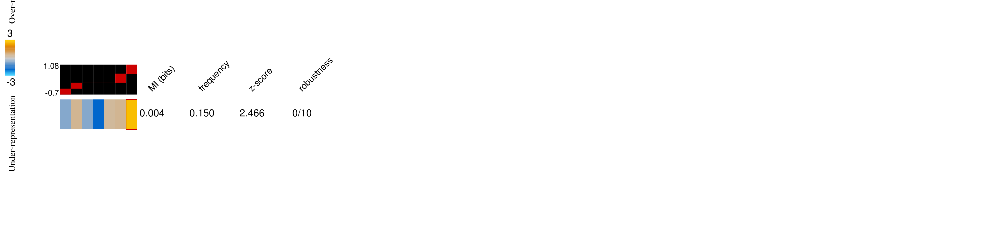

#### hypo_mtyl_ociaml3_delta_stbl
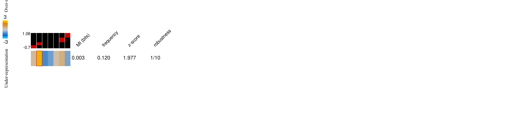

___

#### hyper_mtyl_thp1_delta_stbl
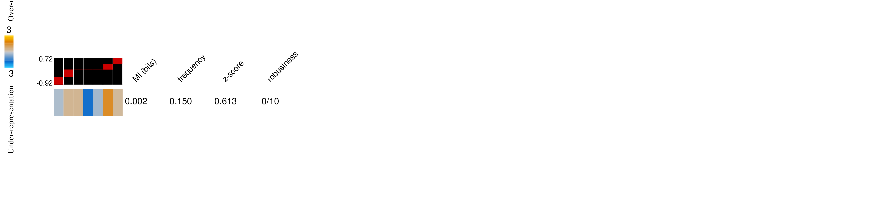

#### hypo_mtyl_thp1_delta_stbl
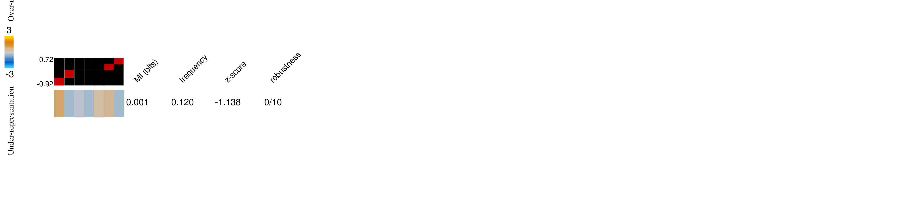

# Ribo-seq data
We have used [Ribolog](https://github.com/goodarzilab/Ribolog) to estimate differential translational efficiency (lnTE). 

#### hyper_mtyl_hl60_delta_te
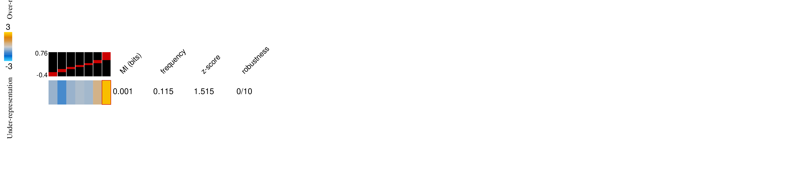

#### hypo_mtyl_hl60_delta_te
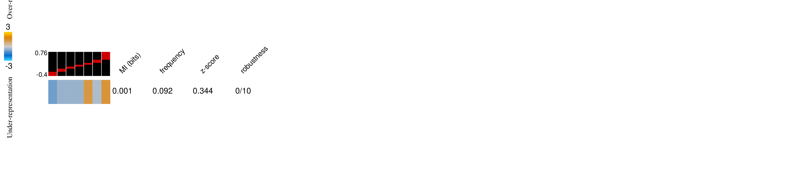
