Here, we aim to test the enrichment of hyper methylated genes with:
- Δmethylation >= 2  as hyper-methylation sites (P-Value < 0.01)
- Δmethylation <= -2 as hypo-methylation sites  (P-Value < 0.01)

First row: Hyper-methylated geneset
Second row: Hypo-methylated geneset

## HL-60 cell line - Time series experiment
### Differential RNA Expression
#### 6h_delta_exp
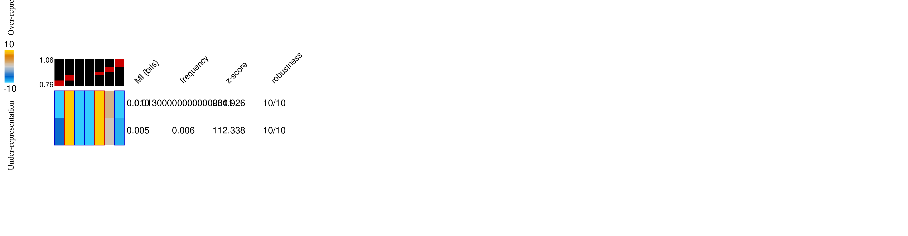

___

#### 72h_delta_exp
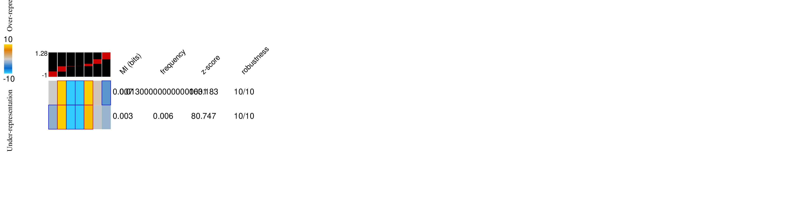

___

#### 120h_delta_exp
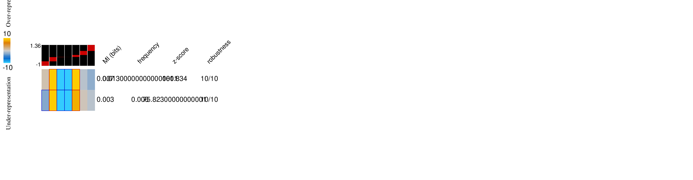

## 5 other AML cell lines 
#### kg1_delta_exp
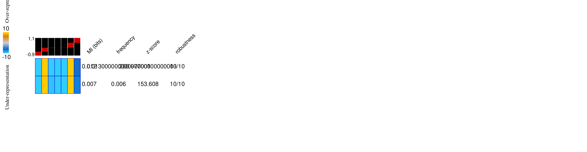

___

#### molm14_delta_exp
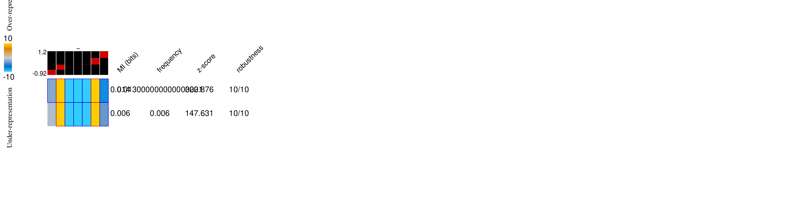

___

#### ociaml2_delta_exp
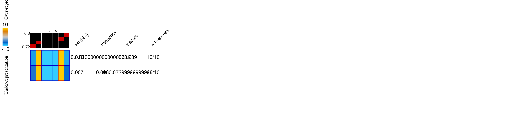

___

#### ociaml3_delta_exp

___

#### thp1_delta_exp
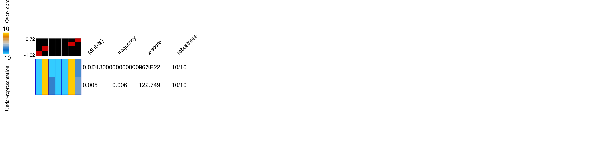

### Differential RNA Stability 
#### 6h_delta_stbl
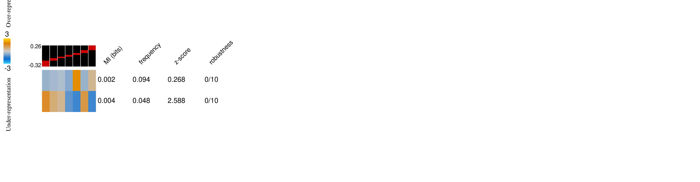

___

#### 120h_delta_stbl
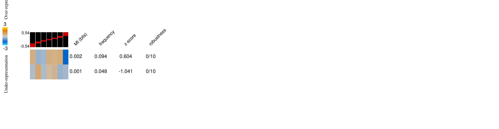

## 5 other AML cell lines 

#### kg1_delta_stbl

___

#### molm14_delta_stbl

___

#### ociaml2_delta_stbl
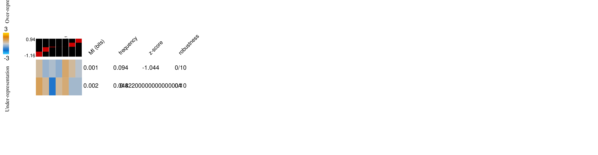

___

#### ociaml3_delta_stbl
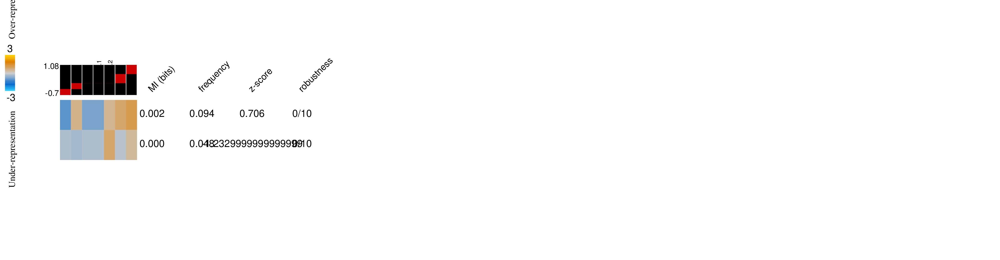

___

#### thp1_delta_stbl
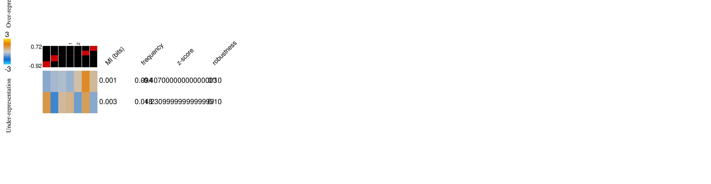

# Ribo-seq data
We have used [Ribolog](https://github.com/goodarzilab/Ribolog) to estimate differential translational efficiency (lnTE). 

#### hl60_delta_te
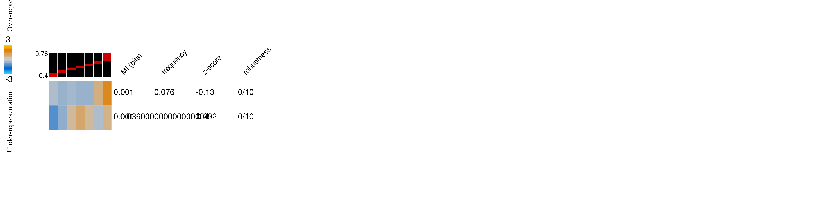