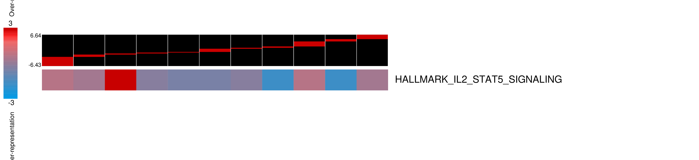
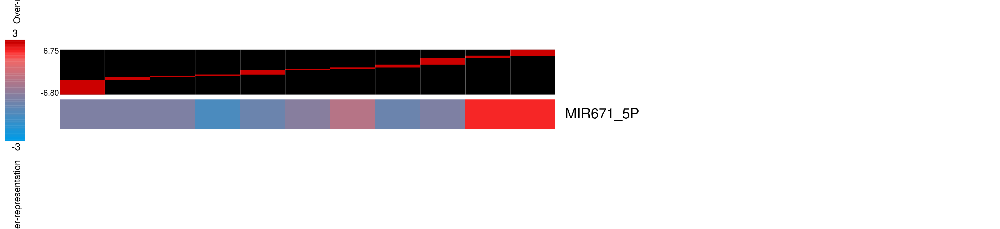
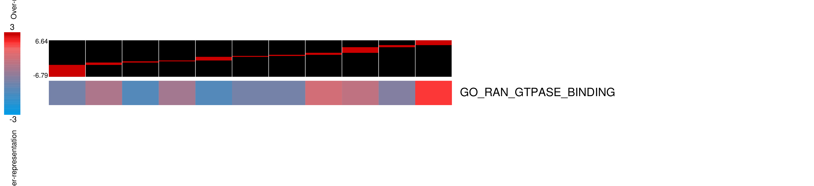
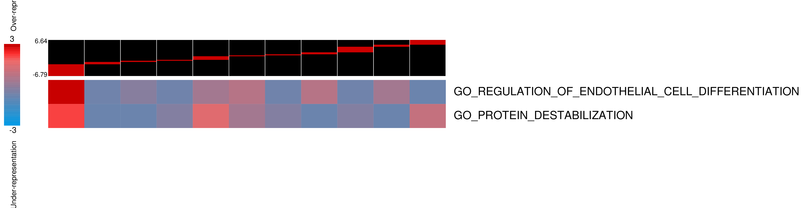
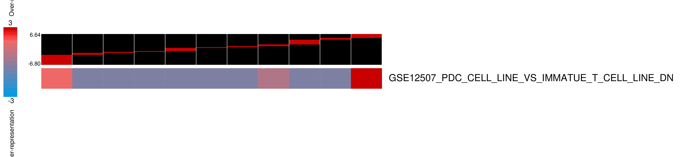
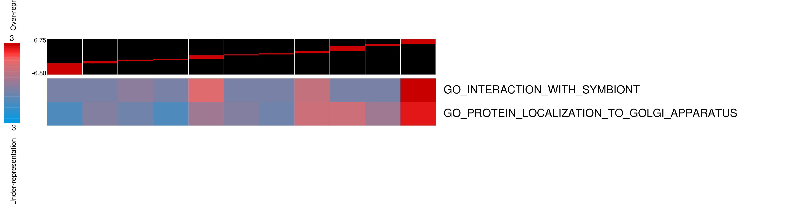
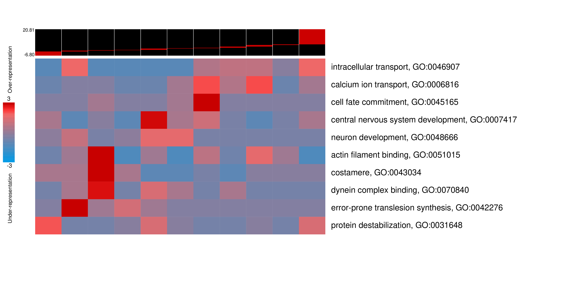
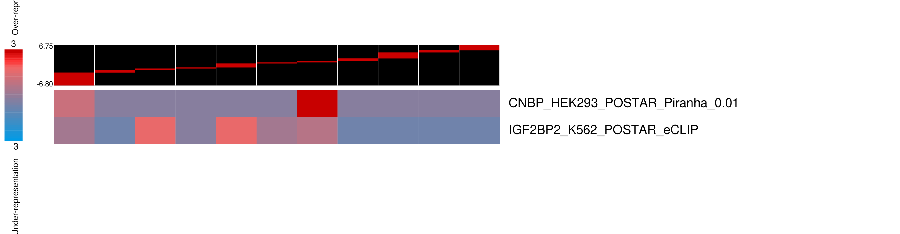
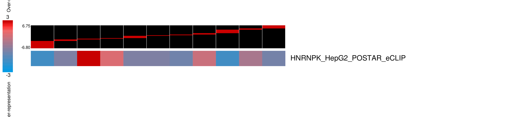

> We have already established that using annotated HeLa m6A sites, we can observe changes in genes with m6A sites (HL-60) cells. In order to confirm this m6A sites, we performed MeRIP-seq in treated and untreated cells, and did observe a general increase in m6A levels upon treatments for a large number of annotated sites. Here, our goal is to indpendently analyze the MeRIP data without relying on HeLa annotations and use it to define a **treatment-induced hyper-methylation sites**. We will then assess the location and behaviour of these targets across the other datasets generated in this study.

# meRIP-seq data 

### Meta-gene plot
As a quality control, we confirm mRNA Methylation sites enriched in 3′ UTRs and near stop codons same as this Cell paper 
https://doi.org/10.1016/j.cell.2012.05.003

<table>
  <tr>
    <td>
  <tr>
<table>
<table>
  <tr>
    <td>
    <td>
  <tr>
<table>

### Motif analysis 


__Results from [FIRE](https://github.com/goodarzilab/FIRE)__ shown above indicate that the known m6A site **DRACH** and **RGAC** (or `[AG]GAC` and `[AGT][AG]AC[ACT]` in regular expression form) are significantly enriched among the **~4700** methylations sites.


# Drug-induced methylation enrichment analysis 
https://github.com/goodarzilab/PAGE

### msigdb_hallmarks


### msigdb_c3



```python
cat hl60_delta_mtyl/human_ensembl_msigdb_c3/pvmatrix.txt.killed 
```

- MIR4666B, MIR4666B
	- MIR6730_3P, MIR6730_3P
	- MIR3064_3P, MIR3064_3P
- MIR671_5P, MIR671_5P
	- HIVEP1_TARGET_GENES, HIVEP1_TARGET_GENES

### msigdb_c5




```python
cat hl60_delta_mtyl/human_ensembl_msigdb_c5/pvmatrix.txt.killed 
```
- GO_PROTEIN_DESTABILIZATION, GO_PROTEIN_DESTABILIZATION
	- GO_PEPTIDYL_LYSINE_ACETYLATION, GO_PEPTIDYL_LYSINE_ACETYLATION
	- GO_TRANSCRIPTION_INITIATION_FROM_RNA_POLYMERASE_II_PROMOTER, GO_TRANSCRIPTION_INITIATION_FROM_RNA_POLYMERASE_II_PROMOTER
	- GO_PROTEIN_ACETYLATION, GO_PROTEIN_ACETYLATION
	- GO_LIPID_HOMEOSTASIS, GO_LIPID_HOMEOSTASIS
	- GO_REGULATION_OF_ANDROGEN_RECEPTOR_SIGNALING_PATHWAY, GO_REGULATION_OF_ANDROGEN_RECEPTOR_SIGNALING_PATHWAY
	- GO_NUCLEOTIDE_EXCISION_REPAIR, GO_NUCLEOTIDE_EXCISION_REPAIR
- GO_RAN_GTPASE_BINDING, GO_RAN_GTPASE_BINDING
	- GO_NLS_BEARING_PROTEIN_IMPORT_INTO_NUCLEUS, GO_NLS_BEARING_PROTEIN_IMPORT_INTO_NUCLEUS
	- GO_REGULATION_OF_CARBOHYDRATE_CATABOLIC_PROCESS, GO_REGULATION_OF_CARBOHYDRATE_CATABOLIC_PROCESS
	- GO_NUCLEAR_PORE, GO_NUCLEAR_PORE
	- GO_PROTEIN_IMPORT, GO_PROTEIN_IMPORT
- GO_REGULATION_OF_ENDOTHELIAL_CELL_DIFFERENTIATION, GO_REGULATION_OF_ENDOTHELIAL_CELL_DIFFERENTIATION
	- GO_REGULATION_OF_EPITHELIAL_CELL_DIFFERENTIATION, GO_REGULATION_OF_EPITHELIAL_CELL_DIFFERENTIATION
	- GO_POSITIVE_REGULATION_OF_DEVELOPMENTAL_GROWTH, GO_POSITIVE_REGULATION_OF_DEVELOPMENTAL_GROWTH
	- GO_REGULATION_OF_MUSCLE_ORGAN_DEVELOPMENT, GO_REGULATION_OF_MUSCLE_ORGAN_DEVELOPMENT
	- GO_CENTROSOME_DUPLICATION, GO_CENTROSOME_DUPLICATION
	- GO_HEART_VALVE_DEVELOPMENT, GO_HEART_VALVE_DEVELOPMENT
	- GO_NEURON_FATE_COMMITMENT, GO_NEURON_FATE_COMMITMENT
	- GO_PULMONARY_VALVE_MORPHOGENESIS, GO_PULMONARY_VALVE_MORPHOGENESIS
	- GO_POSITIVE_REGULATION_OF_NOTCH_SIGNALING_PATHWAY, GO_POSITIVE_REGULATION_OF_NOTCH_SIGNALING_PATHWAY
	- GO_POSITIVE_REGULATION_OF_SMALL_GTPASE_MEDIATED_SIGNAL_TRANSDUCTION, GO_POSITIVE_REGULATION_OF_SMALL_GTPASE_MEDIATED_SIGNAL_TRANSDUCTION


### msigdb_c7



```python
cat hl60_delta_mtyl/human_ensembl_msigdb_c7/pvmatrix.txt.killed 
```

- GSE12507_PDC_CELL_LINE_VS_IMMATUE_T_CELL_LINE_DN, GSE12507_PDC_CELL_LINE_VS_IMMATUE_T_CELL_LINE_DN
	- GSE37532_TREG_VS_TCONV_CD4_TCELL_FROM_LN_UP, GSE37532_TREG_VS_TCONV_CD4_TCELL_FROM_LN_UP
	- GSE20715_0H_VS_6H_OZONE_LUNG_DN, GSE20715_0H_VS_6H_OZONE_LUNG_DN
	- GSE3982_EOSINOPHIL_VS_TH2_UP, GSE3982_EOSINOPHIL_VS_TH2_UP
	- GSE36527_CD62L_HIGH_CD69_NEG_VS_CD62L_LOW_CD69_POS_TREG_KLRG1_NEG_DN, GSE36527_CD62L_HIGH_CD69_NEG_VS_CD62L_LOW_CD69_POS_TREG_KLRG1_NEG_DN

### msigdb_full


<!-- ### human_ensembl
 -->

<!-- ### RBPs_coding_gene_ids_by_5UTR
 -->

<!-- ### RBPs_coding_gene_ids_by_coding_exons
 -->

<!-- ### RBPs_coding_gene_ids_by_introns

 -->
