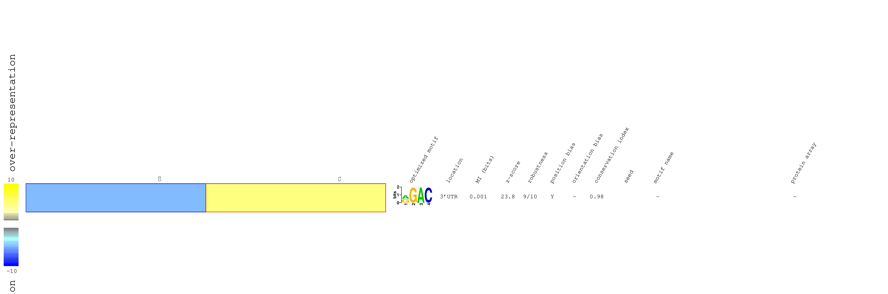

> We have already established that using annotated HeLa m6A sites, we can observe changes in genes with m6A sites (HL-60) cells. In order to confirm this m6A sites, we performed MeRIP-seq in treated and untreated cells, and did observe a general increase in m6A levels upon treatments for a large number of annotated sites. Here, our goal is to indpendently analyze the MeRIP data without relying on HeLa annotations and use it to define a **treatment-induced hyper-methylation sites**. We will then assess the location and behaviour of these targets across the other datasets generated in this study.

# meRIP-seq data 

### Meta-gene plot
As a quality control, we confirm mRNA Methylation sites enriched in 3′ UTRs and near stop codons same as this Cell paper 
https://doi.org/10.1016/j.cell.2012.05.003

<table>
  <tr>
    <td>
  <tr>
<table>
<table>
  <tr>
    <td>
    <td>
  <tr>
<table>

### Motif analysis 

__Results from [`FIRE`](https://github.com/goodarzilab/FIRE)__ shown above indicate that the known m6A site **RGAC** (`[AG]GAC`) are significantly enriched among methylations sites predicted by `exomepeak`. Althogh, the other known motif, **DRACH** (`[AGT][AG]AC[ACT]`) didn't enrich. 

# Drug-induced methylation enrichment analysis 
https://github.com/goodarzilab/PAGE
[coming soon]